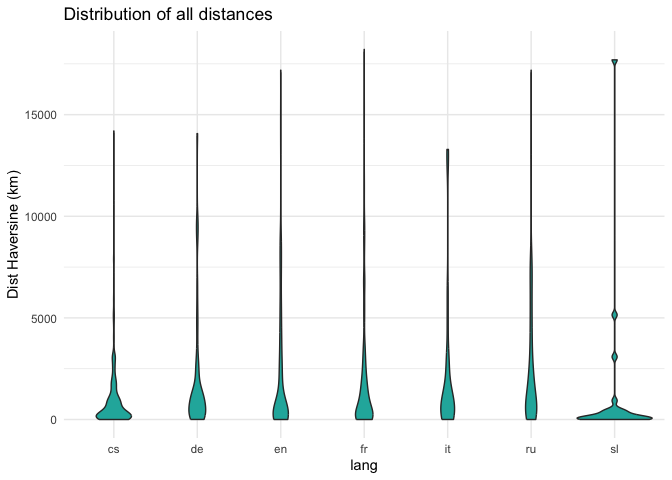
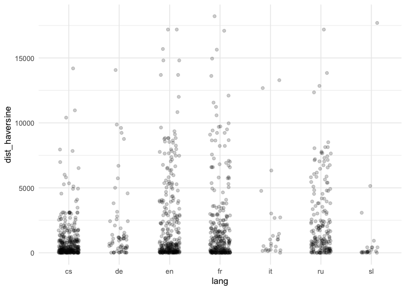
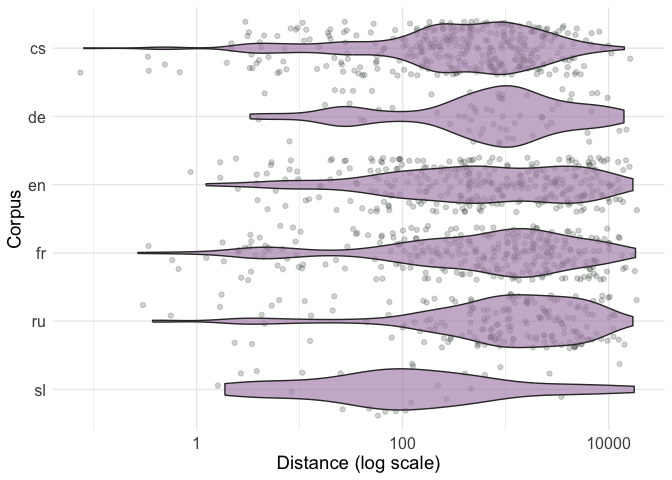
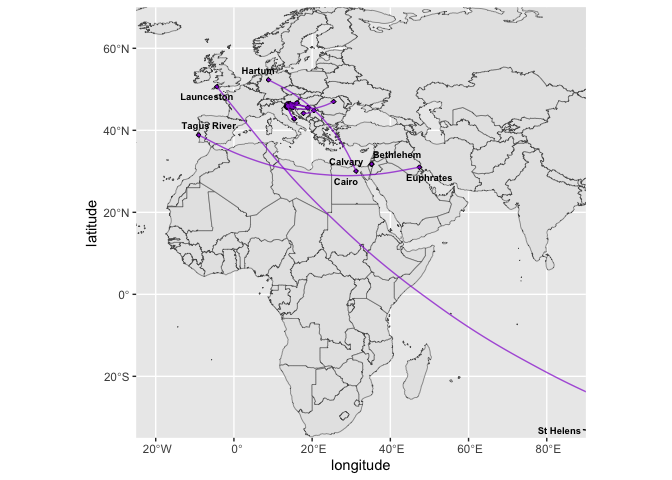
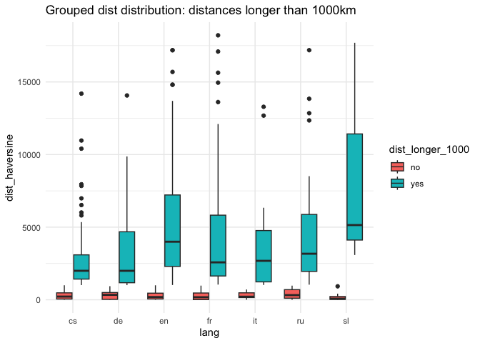
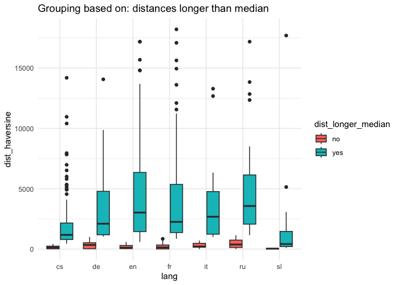
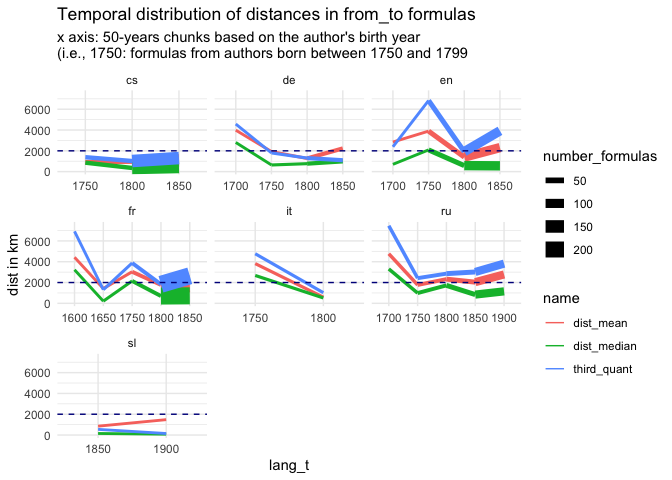
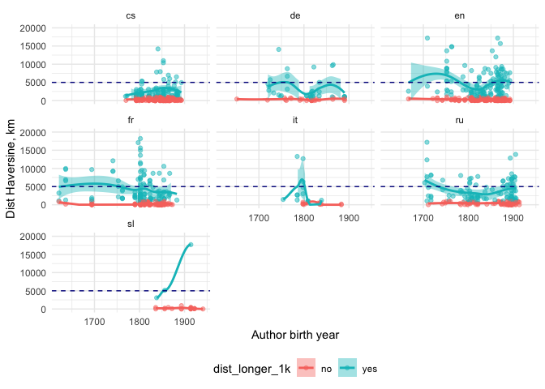

# 01 geodata exploration

## Explore directions of from_to formula

Read data as a table (flatted & merged json-s)

``` r
formulas <- read.csv("../data/formulas_table.csv")
glimpse(formulas)
```

    Rows: 1,255
    Columns: 16
    $ lang           <chr> "cs", "cs", "cs", "cs", "cs", "cs", "cs", "cs", "cs", "…
    $ doc_key        <chr> "0001_0001-0001-0000-0008-0000", "0036_0001-0000-0000-0…
    $ from_id        <chr> "Q1497", "Q584", "Q1410", "Q155975", "Q155975", "Q545",…
    $ to_id          <chr> "Q668", "Q545", "Q545", "Q1887287", "Q1085", "Q13924", …
    $ text           <chr> "od břehů širých otce Missisipi až k Indu", "od Pyramid…
    $ author_name    <chr> "Albert, Eduard", "Breska, Alfons", "Breska, Alfons", "…
    $ year_birth     <int> 1841, 1873, 1873, 1857, 1857, 1836, 1836, 1836, 1836, 1…
    $ year_death     <int> 1900, 1946, 1946, 1890, 1890, 1905, 1905, 1905, 1905, 1…
    $ from_placename <chr> "Mississippi River", "Rhine", "Gibraltar", "Kutná Hora"…
    $ from_type      <chr> "default", "river", "default", "default", "default", "d…
    $ from_latitude  <dbl> 29.15360, 47.66620, 36.14000, 49.94844, 49.94844, 58.00…
    $ from_longitude <dbl> -89.250800, 9.178600, -5.350000, 15.268226, 15.268226, …
    $ to_placename   <chr> "India", "Baltic Sea", "Baltic Sea", "Malešov", "Prague…
    $ to_type        <chr> "country", "default", "default", "default", "default", …
    $ to_latitude    <dbl> 22.80000, 58.00000, 58.00000, 49.91107, 50.08750, 42.77…
    $ to_longitude   <dbl> 83.00000, 20.00000, 20.00000, 15.22440, 14.42139, 15.42…

N formulas per language

### MF loc vs from_to loc

Look if most most freq locations also appear in from_to formula

    Rows: 16,158
    Columns: 6
    $ corpus <chr> "cs", "cs", "cs", "cs", "cs", "cs", "cs", "cs", "cs", "cs", "cs…
    $ qid    <chr> "Q1085", "Q213", "Q220", "Q46", "Q142", "Q131574", "Q90", "Q174…
    $ label  <chr> "Prague", "Czech Republic", "Rome", "Europe", "France", "Vltava…
    $ count  <int> 2698, 1732, 1366, 781, 612, 588, 537, 500, 463, 436, 369, 341, …
    $ lat    <dbl> 50.08750, 50.00000, 41.89306, 48.69096, 47.00000, 50.34769, 48.…
    $ lon    <dbl> 14.421389, 15.000000, 12.482778, 9.140620, 2.000000, 14.474382,…

    # A tibble: 140 × 8
       id         qid     lang  label   rank_ft rank_total from_to_count total_count
       <chr>      <chr>   <chr> <chr>     <int>      <int>         <int>       <int>
     1 cs_Q157290 Q157290 cs    Bohemi…       1         14            54         300
     2 cs_Q1085   Q1085   cs    Prague        2          1            28        2698
     3 cs_Q194263 Q194263 cs    Tatra …       3         12            23         341
     4 cs_Q13924  Q13924  cs    Adriat…       4        107            20          37
     5 cs_Q1653   Q1653   cs    Danube        5         11            19         369
     6 cs_Q43266  Q43266  cs    Moravia       6         10            19         436
     7 cs_Q545    Q545    cs    Baltic…       7         62            17          74
     8 cs_Q214644 Q214644 cs    Giant …       8         42            14         119
     9 cs_Q131574 Q131574 cs    Vltava        9          6            12         588
    10 cs_Q35600  Q35600  cs    Ural M…      10         99            10          41
    # ℹ 130 more rows

It’s a long table, just some observations:

-   Czech:

    -   top in both lists (top-20): Bohemian Forest, Prague, Tatra
        mountains, Danube, Moravia, Vltava, ROME (!) , Czechia, Elbe,
        Vienna;

    -   many mountains which is not the case for other corpora

-   DE:

    -   top-20 loc in both: Vienna, Rhine, Paris, Berlin

    -   all other locs are quite rare if not in from_to; top from_to
        ranks are weird?? (Gotha, Eisenach, ALtona.. mb they come from
        some refrains, need to check that)

-   EN:

    -   England, France, Egypt (!), Spain, Rome

    -   top-1 is Maine (?)

    -   many frequent distant locations (china, nile); also not all top
        from_to locs are frequent

-   FR:

    -   Paris, Rome, France, Kythira (wtf), Rhine;

    -   top-3 locs are very highly cor within lists, overall cor is also
        not that bad; meaning from-to locs are important locs in general
        (eg Bordeau, Nice, Louvre Palace); some long-distance things in
        from-to also – Volga, Tiber

-   IT:

    -   Alps, Apennninne Mountaints, Tiber (?)

    -   the rest from-to are strange places, mb Rhine & Seine are
        obvious but the rest are strange

-   RU:

    -   Neva, Moscow, Rome (!), SPb, Crimea, Msc Kremlin, Siberia (21
        total rank), Caucasus, Kyiv, Nile (lol), Volga

    -   very obvious places mostly within Russia, China is an exception,
        not than much west expansion visible in from-to from here

-   SL:

    -   Triglav, Soča, Ardiatic sea, Ljubljana, Trieste, Sava

    -   most locs are some within Sl I guess + mostly single counts in
        from_to

## distances

I calculated Haversine (bird/plane flight) distance between the
from-\>to coordinates, the distance is in km.

### calculation

``` r
# calculate haversine distances between from_to points in current table

formulas_d <- formulas %>% 
  rowwise() %>% 
  mutate(dist_haversine = distHaversine(
    c(from_longitude, from_latitude),
    c(to_longitude, to_latitude)) 
      / 1000) %>% 
  ungroup() %>% 
  # make numbers human-readable
  mutate(dist_haversine = round(dist_haversine, digits = 3)) 

head(formulas_d %>% select(lang, text, from_placename, to_placename, dist_haversine))
```

    # A tibble: 6 × 5
      lang  text                          from_placename to_placename dist_haversine
      <chr> <chr>                         <chr>          <chr>                 <dbl>
    1 cs    od břehů širých otce Missisi… Mississippi R… India              14195.  
    2 cs    od Pyramid k Rýnu , od Gibra… Rhine          Baltic Sea          1358.  
    3 cs    od Gibraltaru k bouřným vlná… Gibraltar      Baltic Sea          3063.  
    4 cs    od Hor Kuten k Malešovu       Kutná Hora     Malešov                5.21
    5 cs    Od Hor Kuten veden k Praze    Kutná Hora     Prague                62.5 
    6 cs    od Baltu až k Adrii           Baltic Sea     Adriatic Sea        1725.  

### analysis

#### overall

Poet’s mind is often flying not that far away? (the line is trochee-2
btw)





What I see here: most of the distances are actually very small; but for
some traditions there are quite a portion of longer ones.

The problem is the threshold here: would we want to divide into
short/long groups based on any corpus-related number (mean/med dist?
country size? which country then), or to set an arbitrary baseline like
everything less then 1000km is a small distance, and anything longer –
is long?

### dist summary stats

Calculate mean & median dist for each corpus + 3rd quantile

    # A tibble: 7 × 4
      lang  dist_mean dist_median third_quant
      <chr>     <dbl>       <dbl>       <dbl>
    1 cs        1009.       427.        1172.
    2 de        1940.      1007.        1995.
    3 en        2218.       592.        2996.
    4 fr        2031.       849.        2222.
    5 it        2168.       863.        2377.
    6 ru        2408.      1145.        3536.
    7 sl        1232.        90.9        419.

Plot based on the groups long / short distances:

I just wanted to see how these values are distributed, should we divide
them in two groups





Same grouping method for all: dist is short is \< 1000km, long if
\>1000km



#### Time: distances based on author birth year

This is how author’s birth years are distributed, if we’re only looking
in our formulas subset



Add time period column & recalculate summary dist metrics: I aggregated
based on the half-century periods the author was born. The question here
was: do authors born in quite distant times uses different distances
when from_to formula appears?

    # A tibble: 30 × 5
       lang_t       dist_mean dist_median third_quant number_formulas
       <chr>            <dbl>       <dbl>       <dbl>           <int>
     1 cs 1750—1799      916.        862.       1388.              31
     2 cs 1800—1849      956.        350.       1019.             150
     3 cs 1850—1899     1078.        449.       1305.             160
     4 de 1650—1699      421.        421.        421.               1
     5 de 1700—1749     3986.       2805.       4576.               9
     6 de 1750—1799     1929.        639.       1800.              12
     7 de 1800—1849     1266.        766.       1302.              28
     8 de 1850—1899     2231.        985.       1093.              12
     9 en 1650—1699     1519.       1519.       2046.               2
    10 en 1700—1749     2846.        701.       2386.               9
    # ℹ 20 more rows

    Joining with `by = join_by(lang_t)`



-   overall: we can see than Czech, German, & Slovenian from_to
    aggregated(!) distances are usually below 2k km; longest from-to are
    en, fr, and somewhat ru;

-   NB: my 2000 km threshold is absolutely arbitrary; also, I removed
    periods with less than 5 formulas;

-   Peaks details:

    -   DE: peak period 1700-1749 is only 9 formulas, may be a random
        result

    -   EN: authors born in 1750-1799: 40 formulas found; for 1800-1849
        & 1850-1899 even more data (104 & 158 resp.) –\> these dist are
        really long on average;

    -   FR: low number of formulas for any period before 1750-1799;
        1800-1849 has 200+ though, so also long;

    -   RU: most formulas come from authors born in 18500-1899; but for
        18c-authors there are 18 (1700-1749) and 24 (1750-1799) formulas
        respectively, so it actually can tell us something – like that
        these from-to mean/median distances are stable high

### short vs long dist

Previous plot was just aggregating all distances based on 50-year period
and calculated means etc. Here I did not do any aggregation, but divided
the observations in two groups (\> or \<1000km distance). Then I put
everything on roughly the same timeline (no aggregation, just formulas +
author’s year birth)

    `geom_smooth()` using method = 'loess' and formula = 'y ~ x'



For longer distances: everyone except EN and FR are usually below the 5k
distances even for longer ones? ru is somewhere inbetween.

So I guess what are the takeouts here:

-   the distribution of from-to distances is very unequal: we actually
    have more closer distances, when something like “from portugal to
    china” situations;

-   however the latter is characteristic at least for Eng, Fr, and mb Ru
    (not surprising but still); for Italy we have too little
    observations; German corpus look to me closer to Czech, than to the
    ‘expansion’ ones;

-   I think we should consider dividing the distances in groups for
    sure, otherwise short distances are practically invisible;

-   Question what I’m not sure about is the threshold between short/long
    distance though, should it be calculated for each country
    separately, or not, etc. FOR NOW I just used 1000km for all corpora.

### Types: river –\> mountain

How distances are related to the types of locations in from-to formula?

#### Overview

total

    # A tibble: 33 × 2
       type_pair                 n
       <chr>                 <int>
     1 default --> default     673
     2 river --> river         105
     3 river --> default        72
     4 mountain --> mountain    63
     5 default --> country      58
     6 default --> river        58
     7 mountain --> default     44
     8 country --> default      42
     9 default --> mountain     34
    10 country --> country      30
    # ℹ 23 more rows

Add groups of shorter / longer distances (simple 1000 km threshold)

    # A tibble: 2 × 2
      dist_type     n
      <chr>     <int>
    1 short       750
    2 long        505

    # A tibble: 7 × 5
      lang  short  long perc_short perc_long
      <chr> <int> <int>      <dbl>     <dbl>
    1 cs      246    95       72.1      27.9
    2 en      185   128       59.1      40.9
    3 fr      166   133       55.5      44.5
    4 ru       88   101       46.6      53.4
    5 de       31    32       49.2      50.8
    6 sl       21     3       87.5      12.5
    7 it       13    13       50        50  

Similar picture to the above: younger literatures are more about closer
distances (cs % short – 72%? sl — 87%), while others are more equal to
50/50

    # A tibble: 33 × 3
       type_pair             short  long
       <chr>                 <int> <int>
     1 default --> default       1     1
     2 mountain --> mountain     2     9
     3 river --> default         3     4
     4 river --> river           4     2
     5 default --> river         5     6
     6 mountain --> default      6     8
     7 default --> mountain      7    10
     8 country --> default       8     5
     9 default --> country       9     3
    10 country --> country      10     7
    # ℹ 23 more rows

What I see here: ok basically city-city is a universal thing; mountain
to mountain is probably strictly a Czech thing (see below); river-river
is interestingly more like a long-distance thing, than sth else.

Overall rank cor is not very bad, but ofc some things are really only
about long distances (everything with continents) and some are only
about shorter distances (mountain to sea and other way round (probably
also czech feature)).

#### By language

<table data-quarto-postprocess="true">
<colgroup>
<col style="width: 50%" />
<col style="width: 50%" />
</colgroup>
<thead>
<tr class="header">
<th style="text-align: left;" data-quarto-table-cell-role="th">lang</th>
<th style="text-align: left;"
data-quarto-table-cell-role="th">top_list</th>
</tr>
</thead>
<tbody>
<tr class="odd">
<td style="text-align: left;">cs</td>
<td style="text-align: left;">default --&gt; default (128)<br />
mountain --&gt; mountain (50)<br />
river --&gt; river (25)<br />
river --&gt; default (20)<br />
mountain --&gt; default (19)</td>
</tr>
<tr class="even">
<td style="text-align: left;">de</td>
<td style="text-align: left;">default --&gt; default (43)<br />
river --&gt; river (8)<br />
default --&gt; river (3)<br />
country --&gt; country (2)<br />
default --&gt; country (2)</td>
</tr>
<tr class="odd">
<td style="text-align: left;">en</td>
<td style="text-align: left;">default --&gt; default (182)<br />
default --&gt; country (23)<br />
default --&gt; river (20)<br />
river --&gt; river (20)<br />
country --&gt; country (16)</td>
</tr>
<tr class="even">
<td style="text-align: left;">fr</td>
<td style="text-align: left;">default --&gt; default (199)<br />
river --&gt; river (30)<br />
river --&gt; default (13)<br />
country --&gt; default (12)<br />
default --&gt; country (12)</td>
</tr>
<tr class="odd">
<td style="text-align: left;">it</td>
<td style="text-align: left;">default --&gt; default (12)<br />
mountain --&gt; default (4)<br />
default --&gt; river (2)<br />
river --&gt; default (2)<br />
river --&gt; river (2)</td>
</tr>
<tr class="even">
<td style="text-align: left;">ru</td>
<td style="text-align: left;">default --&gt; default (93)<br />
river --&gt; default (20)<br />
river --&gt; river (19)<br />
default --&gt; river (14)<br />
country --&gt; default (9)</td>
</tr>
<tr class="odd">
<td style="text-align: left;">sl</td>
<td style="text-align: left;">default --&gt; default (16)<br />
default --&gt; mountain (2)<br />
mountain --&gt; sea (2)<br />
river --&gt; default (2)<br />
default --&gt; river (1)<br />
river --&gt; river (1)</td>
</tr>
</tbody>
</table>

#### longer vs shorter distances

    # A tibble: 70 × 4
       lang  dist_type type_pair                 n
       <chr> <chr>     <chr>                 <int>
     1 cs    long      river --> river          16
     2 cs    long      default --> default      14
     3 cs    long      river --> default        11
     4 cs    long      mountain --> mountain     8
     5 cs    long      default --> country       6
     6 cs    long      default --> sea           6
     7 cs    long      mountain --> default      6
     8 cs    short     default --> default     114
     9 cs    short     mountain --> mountain    42
    10 cs    short     mountain --> default     13
    # ℹ 60 more rows

Also a long table, some summary from me:

-   I don’t take ‘deafult’ into account here: we should tag it manually
    to understand what it is;

<!-- -->

-   cs: some distinction that long distances are rather river-to-river,
    while short are mountain-to-mountain;

-   en: long dist are about sth\<-\>country; short include many rivers
    sometimes;

-   fr: also a portion of long river-river distances;

-   ru: same as above;

### from-to places

Just lists of real places, I’m not sure we need to think about this now
(not too many observations also)

                              from_to_pair n
    1  Giant Mountains --> Bohemian Forest 9
    2  Bohemian Forest --> Tatra Mountains 8
    3          Baltic Sea --> Adriatic Sea 6
    4                   Gotha --> Eisenach 6
    5                   Moravia --> Prague 5
    6                Bordeaux --> Narbonne 4
    7              Bratton --> Porlock Bay 4
    8                   France --> England 4
    9               Alps --> Pas-de-Calais 3
    10                   Beersheba --> Dan 3
    11  Bohemian Forest --> Ural Mountains 3
    12                  Canada --> Georgia 3
    13                 Florence --> Altona 3
    14         Giant Mountains --> Moravia 3
    15                      Paris --> Rome 3
    16             River Feale --> Kenmare 3
    17              River Thames --> Tiber 3
    18                       Rome --> Rome 3
    19          Sněžka --> Bohemian Forest 3
    20 Tatra Mountains --> Bohemian Forest 3

By language

<table data-quarto-postprocess="true">
<thead>
<tr class="header">
<th style="text-align: left;" data-quarto-table-cell-role="th">lang</th>
<th style="text-align: left;"
data-quarto-table-cell-role="th">from_to_pair</th>
<th style="text-align: right;" data-quarto-table-cell-role="th">n</th>
</tr>
</thead>
<tbody>
<tr class="odd">
<td style="text-align: left;">cs</td>
<td style="text-align: left;">Giant Mountains --&gt; Bohemian
Forest</td>
<td style="text-align: right;">9</td>
</tr>
<tr class="even">
<td style="text-align: left;">cs</td>
<td style="text-align: left;">Bohemian Forest --&gt; Tatra
Mountains</td>
<td style="text-align: right;">8</td>
</tr>
<tr class="odd">
<td style="text-align: left;">cs</td>
<td style="text-align: left;">Baltic Sea --&gt; Adriatic Sea</td>
<td style="text-align: right;">6</td>
</tr>
<tr class="even">
<td style="text-align: left;">cs</td>
<td style="text-align: left;">Moravia --&gt; Prague</td>
<td style="text-align: right;">5</td>
</tr>
<tr class="odd">
<td style="text-align: left;">cs</td>
<td style="text-align: left;">Bohemian Forest --&gt; Ural Mountains</td>
<td style="text-align: right;">3</td>
</tr>
<tr class="even">
<td style="text-align: left;">de</td>
<td style="text-align: left;">Gotha --&gt; Eisenach</td>
<td style="text-align: right;">6</td>
</tr>
<tr class="odd">
<td style="text-align: left;">de</td>
<td style="text-align: left;">Florence --&gt; Altona</td>
<td style="text-align: right;">3</td>
</tr>
<tr class="even">
<td style="text-align: left;">de</td>
<td style="text-align: left;">Aachen --&gt; Tczew</td>
<td style="text-align: right;">1</td>
</tr>
<tr class="odd">
<td style="text-align: left;">de</td>
<td style="text-align: left;">Adige --&gt; Rhine</td>
<td style="text-align: right;">1</td>
</tr>
<tr class="even">
<td style="text-align: left;">de</td>
<td style="text-align: left;">Amsterdam --&gt; Lübeck</td>
<td style="text-align: right;">1</td>
</tr>
<tr class="odd">
<td style="text-align: left;">en</td>
<td style="text-align: left;">Bratton --&gt; Porlock Bay</td>
<td style="text-align: right;">4</td>
</tr>
<tr class="even">
<td style="text-align: left;">en</td>
<td style="text-align: left;">Beersheba --&gt; Dan</td>
<td style="text-align: right;">3</td>
</tr>
<tr class="odd">
<td style="text-align: left;">en</td>
<td style="text-align: left;">Canada --&gt; Georgia</td>
<td style="text-align: right;">3</td>
</tr>
<tr class="even">
<td style="text-align: left;">en</td>
<td style="text-align: left;">France --&gt; England</td>
<td style="text-align: right;">3</td>
</tr>
<tr class="odd">
<td style="text-align: left;">en</td>
<td style="text-align: left;">River Feale --&gt; Kenmare</td>
<td style="text-align: right;">3</td>
</tr>
<tr class="even">
<td style="text-align: left;">fr</td>
<td style="text-align: left;">Bordeaux --&gt; Narbonne</td>
<td style="text-align: right;">4</td>
</tr>
<tr class="odd">
<td style="text-align: left;">fr</td>
<td style="text-align: left;">Paris --&gt; Rome</td>
<td style="text-align: right;">3</td>
</tr>
<tr class="even">
<td style="text-align: left;">fr</td>
<td style="text-align: left;">Rome --&gt; Rome</td>
<td style="text-align: right;">3</td>
</tr>
<tr class="odd">
<td style="text-align: left;">fr</td>
<td style="text-align: left;">Alps --&gt; Genoa</td>
<td style="text-align: right;">2</td>
</tr>
<tr class="even">
<td style="text-align: left;">fr</td>
<td style="text-align: left;">Apennine Mountains --&gt; Cologne</td>
<td style="text-align: right;">2</td>
</tr>
<tr class="odd">
<td style="text-align: left;">it</td>
<td style="text-align: left;">Alps --&gt; Lilibaeum</td>
<td style="text-align: right;">2</td>
</tr>
<tr class="even">
<td style="text-align: left;">it</td>
<td style="text-align: left;">Adria --&gt; Trieste</td>
<td style="text-align: right;">1</td>
</tr>
<tr class="odd">
<td style="text-align: left;">it</td>
<td style="text-align: left;">Alps --&gt; Giza pyramid complex</td>
<td style="text-align: right;">1</td>
</tr>
<tr class="even">
<td style="text-align: left;">it</td>
<td style="text-align: left;">Alps --&gt; Palermo</td>
<td style="text-align: right;">1</td>
</tr>
<tr class="odd">
<td style="text-align: left;">it</td>
<td style="text-align: left;">Andes --&gt; Lebanon</td>
<td style="text-align: right;">1</td>
</tr>
<tr class="even">
<td style="text-align: left;">ru</td>
<td style="text-align: left;">Alps --&gt; Pas-de-Calais</td>
<td style="text-align: right;">3</td>
</tr>
<tr class="odd">
<td style="text-align: left;">ru</td>
<td style="text-align: left;">Babylon --&gt; Bethlehem</td>
<td style="text-align: right;">2</td>
</tr>
<tr class="even">
<td style="text-align: left;">ru</td>
<td style="text-align: left;">Baltic Sea --&gt; Siberia</td>
<td style="text-align: right;">2</td>
</tr>
<tr class="odd">
<td style="text-align: left;">ru</td>
<td style="text-align: left;">Beijing --&gt; Rome</td>
<td style="text-align: right;">2</td>
</tr>
<tr class="even">
<td style="text-align: left;">ru</td>
<td style="text-align: left;">Dresden --&gt; Berlin</td>
<td style="text-align: right;">2</td>
</tr>
<tr class="odd">
<td style="text-align: left;">sl</td>
<td style="text-align: left;">Drava --&gt; Soča</td>
<td style="text-align: right;">2</td>
</tr>
<tr class="even">
<td style="text-align: left;">sl</td>
<td style="text-align: left;">Triglav --&gt; Adriatic Sea</td>
<td style="text-align: right;">2</td>
</tr>
<tr class="odd">
<td style="text-align: left;">sl</td>
<td style="text-align: left;">Aquileia --&gt; Triglav</td>
<td style="text-align: right;">1</td>
</tr>
<tr class="even">
<td style="text-align: left;">sl</td>
<td style="text-align: left;">Aurisina --&gt; Sistiana</td>
<td style="text-align: right;">1</td>
</tr>
<tr class="odd">
<td style="text-align: left;">sl</td>
<td style="text-align: left;">Barcola --&gt; Sistiana</td>
<td style="text-align: right;">1</td>
</tr>
</tbody>
</table>

### 

``` r
library(sf)

library(rnaturalearth)
library(rnaturalearthdata)
library(ggrepel)
```

some x to y

``` r
f <- formulas %>% 
  filter(lang == "sl") %>% 
  #sample_n(10) %>% 
  mutate(f_id = row_number()) %>% 
  select(f_id, text,
         from_placename, to_placename, 
         from_latitude, to_latitude, 
         from_longitude, to_longitude
         ) 

from <- f %>% 
  select(f_id, text, from_placename, from_latitude, from_longitude) %>% 
  rename(placename = from_placename,
         latitude = from_latitude,
         longitude = from_longitude)

to <- f %>% 
  select(f_id, text, to_placename, to_latitude, to_longitude) %>% 
  rename(placename = to_placename,
         latitude = to_latitude,
         longitude = to_longitude)


# merge in a longer table
from_to <- rbind(from, to)


glimpse(f)
glimpse(from_to)

# f
# from_to

err <- f[f$from_latitude == f$to_latitude| f$from_longitude == f$to_longitude, ]
```

``` r
ggplot(world) +
  geom_sf() +
  coord_sf(xlim = c(-25, 90), ylim = c(-35,70), expand = FALSE) + 
  geom_point(data = from_to, aes(x = longitude, y = latitude), size = 1, 
       shape = 23, fill = "darkviolet") + 
  geom_curve(data = f %>% 
               filter(!f_id %in% err$f_id), 
             aes(x = from_longitude, y = from_latitude,
                           xend = to_longitude, yend = to_latitude),
             linewidth = 0.5, curvature = 0.2, 
             colour = "darkviolet", alpha = 0.7) +
  geom_text_repel(data = from_to, 
                  aes(x = longitude, y = latitude, label = placename), 
                  size = 2.5, col = "black", fontface = "bold") 
```

#### temporal

``` r
dist_t_summary %>% 
  select(-third_quant) %>% 
  pivot_longer(!c(lang_t, number_formulas),
               names_to = "type", values_to = "dist_km") %>% 
  mutate(lang = str_extract(lang_t, "^.."), 
         lang_t = str_remove(lang_t, "^..."),
         author_birth_halfdecade = str_remove(lang_t, "—....$")) %>% 
  filter(type != "dist_mean") %>% 
  ggplot(aes(x = time, y = dist_km, 
             group = lang, 
             colour = lang)) + 
  geom_line(aes(linewidth = number_formulas))
```
