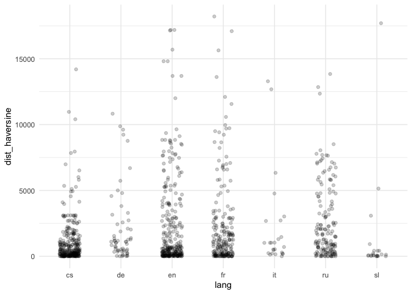
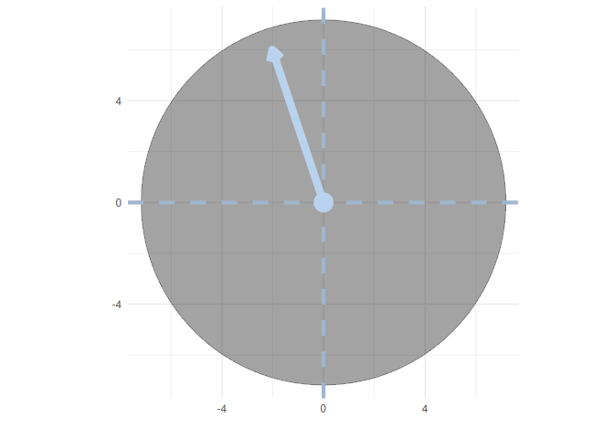
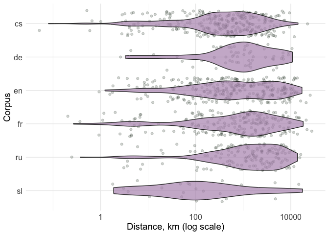
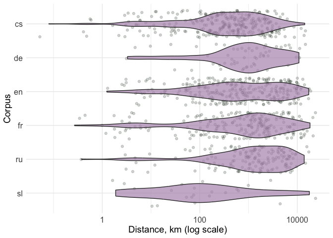
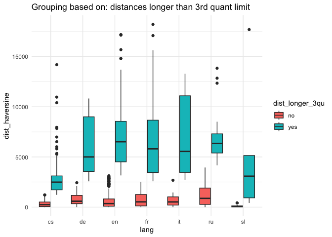
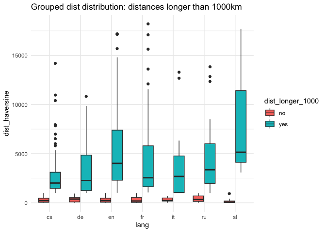
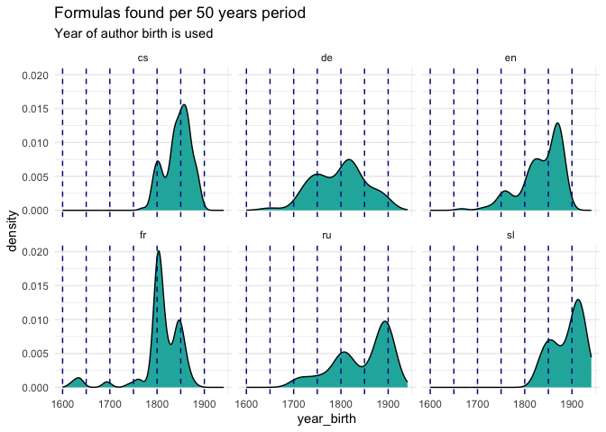
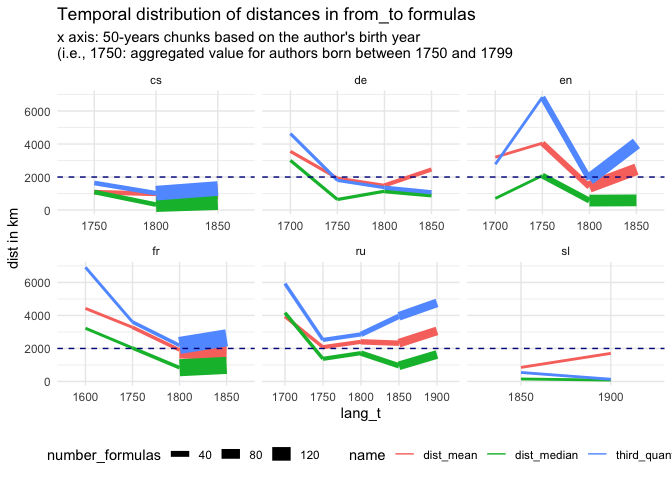
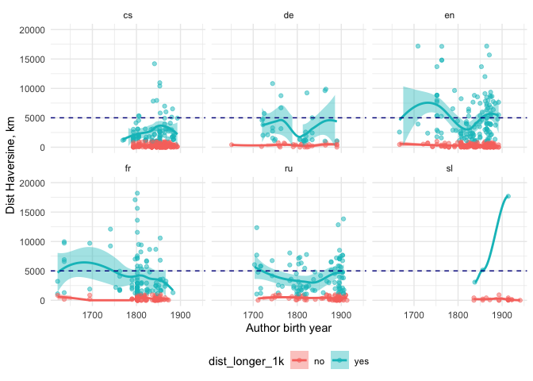

# 01 geodata exploration

# Explore directions of from_to formula

Read data as a table (flatted & merged json-s)

``` r
formulas <- read.csv("../data/formulas_table.csv")
glimpse(formulas)
```

    Rows: 1,088
    Columns: 18
    $ lang           <chr> "cs", "cs", "cs", "cs", "cs", "cs", "cs", "cs", "cs", "…
    $ doc_key        <chr> "0001_0001-0001-0000-0008-0000", "0036_0001-0000-0000-0…
    $ from_id        <chr> "Q1497", "Q37200", "Q1410", "Q155975", "Q155975", "Q545…
    $ to_id          <chr> "Q668", "Q584", "Q545", "Q1887287", "Q1085", "Q13924", …
    $ text           <chr> "od břehů širých otce Missisipi až k Indu", "od Pyramid…
    $ author_name    <chr> "Albert, Eduard", "Breska, Alfons", "Breska, Alfons", "…
    $ year_birth     <int> 1841, 1873, 1873, 1857, 1857, 1836, 1836, 1836, 1836, 1…
    $ year_death     <int> 1900, 1946, 1946, 1890, 1890, 1905, 1905, 1905, 1905, 1…
    $ from_placename <chr> "Mississippi River", "Great Pyramid of Giza", "Gibralta…
    $ from_latitude  <dbl> 29.15360, 29.97915, 36.14000, 49.94844, 49.94844, 58.00…
    $ from_longitude <dbl> -89.250800, 31.134220, -5.350000, 15.268226, 15.268226,…
    $ from_type      <chr> "river", "default", "region", "city", "city", "sea", "m…
    $ from_type_d    <chr> "river", "default", "land", "city", "city", "sea", "mou…
    $ to_placename   <chr> "India", "Rhine", "Baltic Sea", "Malešov", "Prague", "A…
    $ to_latitude    <dbl> 22.80000, 47.66620, 58.00000, 49.91107, 50.08750, 42.77…
    $ to_longitude   <dbl> 83.000000, 9.178600, 20.000000, 15.224397, 14.421389, 1…
    $ to_type        <chr> "country", "river", "sea", "city", "city", "sea", "moun…
    $ to_type_d      <chr> "country", "river", "sea", "city", "city", "sea", "moun…

Keep only ONE from-to direction per poem

``` r
# formulas %>% 
#   distinct() %>% nrow()
# 
# nrow(formulas)

formulas <- formulas %>% 
  distinct()

# just removes 2 rows
```

N formulas per language

## Most freq loc vs from_to loc

Look if most most freq locations also appear in from_to formula

    Rows: 16,158
    Columns: 6
    $ corpus <chr> "cs", "cs", "cs", "cs", "cs", "cs", "cs", "cs", "cs", "cs", "cs…
    $ qid    <chr> "Q1085", "Q213", "Q220", "Q46", "Q142", "Q131574", "Q90", "Q174…
    $ label  <chr> "Prague", "Czech Republic", "Rome", "Europe", "France", "Vltava…
    $ count  <int> 2698, 1732, 1366, 781, 612, 588, 537, 500, 463, 436, 369, 341, …
    $ lat    <dbl> 50.08750, 50.00000, 41.89306, 48.69096, 47.00000, 50.34769, 48.…
    $ lon    <dbl> 14.421389, 15.000000, 12.482778, 9.140620, 2.000000, 14.474382,…

    # A tibble: 139 × 8
       id         qid     lang  label   rank_ft rank_total from_to_count total_count
       <chr>      <chr>   <chr> <chr>     <int>      <int>         <int>       <int>
     1 cs_Q157290 Q157290 cs    Bohemi…       1         14            47         300
     2 cs_Q1085   Q1085   cs    Prague        2          1            25        2698
     3 cs_Q194263 Q194263 cs    Tatra …       3         12            20         341
     4 cs_Q1653   Q1653   cs    Danube        4         11            17         369
     5 cs_Q13924  Q13924  cs    Adriat…       5        107            14          37
     6 cs_Q43266  Q43266  cs    Moravia       6         10            14         436
     7 cs_Q214644 Q214644 cs    Giant …       7         42            13         119
     8 cs_Q545    Q545    cs    Baltic…       8         62            12          74
     9 cs_Q131574 Q131574 cs    Vltava        9          6            10         588
    10 cs_Q220    Q220    cs    Rome         10          3             9        1366
    # ℹ 129 more rows

It’s a long table, just some observations:

-   Czech:

    -   top in both lists (top-20): Bohemian Forest, Prague, Tatra
        mountains, Danube, Moravia, Vltava, ROME (!) , Czechia, Elbe,
        Vyšehrad;

    -   many mountains which is not the case for other corpora (Tatra,
        Giant Mountains, Ural, Sněžka, Alps)

-   DE:

    -   top-20 loc in both: Vienna, Rhine, Paris, Berlin

    -   not many instances overall (only Vienna, Rhine and Paris apprear
        \> 2 times in from-to)

-   EN:

    -   England, France, Egypt (!), Nile, River Thames, Rome, Ireland,
        Spain, India

    -   top-1 is Maine (?)

    -   many frequent distant/non-european locations (china, nile);

-   FR:

    -   Paris, Rome, Kythira (wtf);

    -   top-2 locs are very highly cor within lists, overall cor is
        non-existent; meaning from-to locs are important locs in general
        (eg Bordeau, Nice, Louvre Palace); some long-distance things in
        from-to also – Tiber, Ganges, Memphis, Volga, Cairo

-   IT:

    -   Alps,

    -   too little data (all from-to freq is 2 or 1)

-   RU:

    -   Neva, Moscow, SPb, Volga, Crimea, Msc Kremlin, Caucasus, Kyiv,
        Rome, Nile, Siberia (21 total rank)

    -   very obvious places mostly within Russia, exceptions: Alps,
        Caucasus, Kyiv, Rome, Nile, Vistula, Seine;

-   SL:

    -   Soča (from-to count: 3, else is 2 or less)

    -   most locs are some within Sl I guess + mostly single counts in
        from_to

## Distances

I calculated Haversine (bird/plane flight) distance between the
from-\>to coordinates, the distance is in km.

### calculation

``` r
# calculate haversine distances between from_to points in current table

formulas_d <- formulas %>% 
  rowwise() %>% 
  mutate(dist_haversine = distHaversine(
    c(from_longitude, from_latitude),
    c(to_longitude, to_latitude)) 
      / 1000) %>% 
  ungroup() %>% 
  # make numbers human-readable
  mutate(dist_haversine = round(dist_haversine, digits = 3)) 

head(formulas_d %>% select(lang, text, from_placename, to_placename, dist_haversine))
```

    # A tibble: 6 × 5
      lang  text                          from_placename to_placename dist_haversine
      <chr> <chr>                         <chr>          <chr>                 <dbl>
    1 cs    od břehů širých otce Missisi… Mississippi R… India              14195.  
    2 cs    od Pyramid k Rýnu , od Gibra… Great Pyramid… Rhine               2720.  
    3 cs    od Gibraltaru k bouřným vlná… Gibraltar      Baltic Sea          3063.  
    4 cs    od Hor Kuten k Malešovu       Kutná Hora     Malešov                5.21
    5 cs    Od Hor Kuten veden k Praze    Kutná Hora     Prague                62.5 
    6 cs    od Baltu až k Adrii           Baltic Sea     Adriatic Sea        1725.  

### proportion of dist \> 1000 in lang

    # A tibble: 14 × 5
       lang  dist_long     n n_total  perc
       <chr> <chr>     <int>   <int> <dbl>
     1 cs    long         90     308  29.2
     2 cs    short       218     308  70.8
     3 de    long         32      58  55.2
     4 de    short        26      58  44.8
     5 en    long        124     294  42.2
     6 en    short       170     294  57.8
     7 fr    long        108     217  49.8
     8 fr    short       109     217  50.2
     9 it    long         13      25  52  
    10 it    short        12      25  48  
    11 ru    long         93     162  57.4
    12 ru    short        69     162  42.6
    13 sl    long          3      22  13.6
    14 sl    short        19      22  86.4

### distribution

Poet’s mind is often flying not that far away?





    <ggplot2::labels> List of 2
     $ y    : chr "Dist Haversine (km)"
     $ title: chr "Distribution of all distances"

What I see here: most of the distances are actually very small; but for
some traditions there are quite a portion of longer ones.

The problem is the threshold here: would we want to divide into
short/long groups based on any corpus-related number (mean/med dist?
country size? which country then), or to set an arbitrary baseline like
everything less then 1000km is a small distance, and anything longer –
is long?

### Figure 1: dist distribution

``` r
dist_raw <- formulas_d %>% 
  filter(lang != "it") %>% 
  filter(dist_haversine > 0) %>% 
  ggplot(aes(x = lang, y = dist_haversine, group = lang)) + 
  geom_jitter(alpha = 0.2, width = 0.2, colour = met.brewer("Cassatt2")[10]) + 
  geom_violin(fill = met.brewer("Cassatt2")[4], alpha = 0.7) + 
  labs(y = "Distance (km)",
       x = "Corpus") + 
  theme(axis.text = element_text(size = 12),
        axis.title = element_text(size = 14))

dist_raw
```



``` r
dist_log <- formulas_d %>% 
  filter(lang != "it") %>% 
  filter(dist_haversine > 0) %>% 
  ggplot(aes(y = factor(lang, levels = c("sl", "ru", "fr", "en", "de", "cs")), 
             x = dist_haversine, group = lang)) + 
  geom_jitter(alpha = 0.2, width = 0.2, colour = met.brewer("Cassatt2")[10]) + 
  geom_violin(fill = met.brewer("Cassatt2")[4], alpha = 0.7) + 
  labs(x = "Distance, km (log scale)",
       y = "Corpus") + 
  theme(axis.text = element_text(size = 12),
        axis.title = element_text(size = 14)) + 
  scale_x_log10()

dist_log
```



### dist summary stats

Calculate mean & median dist for each corpus + 3rd quantile

    # A tibble: 7 × 4
      lang  dist_mean dist_median third_quant
      <chr>     <dbl>       <dbl>       <dbl>
    1 cs        1054.       436.        1217.
    2 de        2143.      1100.        2538.
    3 en        2335.       648.        3150.
    4 fr        2213.       974.        2516.
    5 it        2240.      1019.        2681.
    6 ru        2551.      1478.        4112.
    7 sl        1321.        90.9        418.

Plot based on the groups long / short distances:

I just wanted to see how these values are distributed, should we divide
them in two groups




Same grouping method for all: dist is short is \< 1000km, long if
\>1000km



#### Time: distances based on author birth year

This is how author’s birth years are distributed, if we’re only looking
in our formulas subset



Add time period column & recalculate summary dist metrics: I aggregated
based on the half-century periods the author was born. The question here
was: do authors born in quite distant times uses different distances
when from_to formula appears?

    # A tibble: 30 × 5
       lang_t       dist_mean dist_median third_quant number_formulas
       <chr>            <dbl>       <dbl>       <dbl>           <int>
     1 cs 1750—1799     1083.       1095.       1641.              27
     2 cs 1800—1849      982.        330.       1022.             131
     3 cs 1850—1899     1111.        449.       1305.             150
     4 de 1650—1699      421.        421.        421.               1
     5 de 1700—1749     3557.       3009.       4633.              12
     6 de 1750—1799     1929.        639.       1800.              12
     7 de 1800—1849     1494.       1140.       1357.              22
     8 de 1850—1899     2458.        890.       1078.              10
     9 en 1650—1699     1519.       1519.       2046.               2
    10 en 1700—1749     3201.        701.       2773.               8
    # ℹ 20 more rows



-   overall: we can see than Czech, German, & Slovenian from_to
    aggregated(!) distances are usually below 2k km; longest from-to are
    en, fr, and somewhat ru;

-   NB: my 2000 km threshold is absolutely arbitrary; also, I removed
    periods with less than 5 formulas;

-   Peaks details:

    -   DE: peak period 1700-1749 is only 12 formulas, may be a random
        result

    -   EN: authors born in 1750-1799: 40 formulas found; for 1800-1849
        & 1850-1899 even more data (101 & 143 resp.) –\> these dist are
        really long on average;

    -   FR: low number of formulas for any poet-birth period EXCEPT for
        1800-1849;

    -   RU: most formulas come from authors born in 1850-1899 (69); for
        18c-authors there are 15 (1700-1749) and 22 (1750-1799) formulas
        respectively, so it actually can tell us something – like that
        these from-to mean/median distances are stable high

### short vs long dist

Previous plot was just aggregating all distances based on 50-year period
and calculated means etc. Here I did not do any aggregation, but divided
the observations in two groups (\> or \<1000km distance). Then I put
everything on roughly the same timeline (no aggregation, just formulas +
author’s year birth)

    `geom_smooth()` using method = 'loess' and formula = 'y ~ x'



``` r
rm(dist_summary, dist_t_summary, loc_freq, dist_log, dist_raw)
```

    Warning in rm(dist_summary, dist_t_summary, loc_freq, dist_log, dist_raw):
    object 'loc_freq' not found

For longer distances: everyone except EN and FR are usually below the 5k
distances even for longer ones? ru is somewhere inbetween.

So I guess the takeouts are:

-   the distribution of from-to distances is very unequal: we actually
    have more closer distances, when something like “from portugal to
    china” situations;

-   however the latter is characteristic at least for Eng, Fr, and mb Ru
    (not surprising but still); for Italy we have too little
    observations; German corpus looks to me closer to Czech, than to the
    ‘expansion’ ones;

-   I think we should consider dividing the distances in groups for
    sure, otherwise short distances are practically invisible;

-   Question what I’m not sure about is the threshold between short/long
    distance though, should it be calculated for each country
    separately, or not, etc. FOR NOW I just used 1000km for all corpora.

# Types

How distances are related to the types of locations in from-to formula?

### Overview

total

    # A tibble: 20 × 2
       type_pair                   n
       <chr>                   <int>
     1 city --> city             232
     2 river --> river           118
     3 mountain --> mountain      62
     4 country --> country        35
     5 region --> city            31
     6 river --> city             28
     7 region --> region          26
     8 village --> city           26
     9 city --> country           24
    10 city part --> city part    22
    11 city --> river             18
    12 ancient city --> city      17
    13 city --> region            17
    14 city --> village           17
    15 city part --> city         14
    16 region --> mountain        13
    17 region --> river           13
    18 village --> village        13
    19 country --> city           11
    20 region --> country         11

Add groups of shorter / longer distances (simple 1000 km threshold)

    # A tibble: 2 × 2
      dist_type     n
      <chr>     <int>
    1 short       623
    2 long        463

    # A tibble: 7 × 5
      lang  short  long perc_short perc_long
      <chr> <int> <int>      <dbl>     <dbl>
    1 cs      218    90       70.8      29.2
    2 en      170   124       57.8      42.2
    3 fr      109   108       50.2      49.8
    4 ru       69    93       42.6      57.4
    5 de       26    32       44.8      55.2
    6 sl       19     3       86.4      13.6
    7 it       12    13       48        52  

Similar picture to the above: younger literatures are more about closer
distances (cs % short – 72%? sl — 87%), while others are more equal to
50/50

### long/short dist ranks

    # A tibble: 20 × 3
       type_pair               short  long
       <chr>                   <int> <int>
     1 city --> city               1     2
     2 mountain --> mountain       2     5
     3 river --> river             3     1
     4 village --> city            4   107
     5 city part --> city part     5    NA
     6 river --> city              6    10
     7 region --> city             7     7
     8 city --> village            8    39
     9 village --> village         9    NA
    10 city --> river             10    17
    11 city --> region            11    12
    12 city part --> city         12    23
    13 mountain --> river         13    NA
    14 region --> region          14     6
    15 country --> country        15     3
    16 river --> mountain         16    33
    17 ancient city --> city      17     8
    18 region --> river           18    19
    19 city --> mountain          19    28
    20 region --> mountain        20    15

    # A tibble: 20 × 3
       type_pair             short  long
       <chr>                 <int> <int>
     1 river --> river           3     1
     2 city --> city             1     2
     3 country --> country      15     3
     4 city --> country         32     4
     5 mountain --> mountain     2     5
     6 region --> region        14     6
     7 region --> city           7     7
     8 ancient city --> city    17     8
     9 region --> country       37     9
    10 river --> city            6    10
    11 sea --> sea              NA    11
    12 city --> region          11    12
    13 country --> city         26    13
    14 country --> region       46    14
    15 region --> mountain      20    15
    16 river --> region         29    16
    17 city --> river           10    17
    18 island --> city          49    18
    19 region --> river         18    19
    20 sea --> region           NA    20

Notes:

-   city –\> city: is a universal thing, can be close, can be distant

-   river –\> river: same but a bit more prevalent for long

-   regions and countries not unexpectedly used for long distances

-   villages & city parts are for short distances

#### by language

<table>
<colgroup>
<col style="width: 1%" />
<col style="width: 98%" />
</colgroup>
<thead>
<tr class="header">
<th style="text-align: left;">lang</th>
<th style="text-align: left;">top_list</th>
</tr>
</thead>
<tbody>
<tr class="odd">
<td style="text-align: left;">cs</td>
<td style="text-align: left;">city –&gt; city (49) <br> mountain –&gt;
mountain (48) <br> river –&gt; river (28) <br> region –&gt; city (11)
<br> country –&gt; country (8) <br> region –&gt; mountain (8) <br> city
–&gt; river (7) <br> city –&gt; village (7) <br> river –&gt; city (6)
<br> sea –&gt; sea (6)</td>
</tr>
<tr class="even">
<td style="text-align: left;">de</td>
<td style="text-align: left;">city –&gt; city (16) <br> river –&gt;
river (10) <br> village –&gt; city (4) <br> city –&gt; region (2) <br>
country –&gt; country (2)</td>
</tr>
<tr class="odd">
<td style="text-align: left;">en</td>
<td style="text-align: left;">city –&gt; city (57) <br> river –&gt;
river (24) <br> country –&gt; country (19) <br> region –&gt; region (15)
<br> city –&gt; country (10) <br> region –&gt; city (10) <br> village
–&gt; village (9) <br> city –&gt; village (7) <br> river –&gt; city (7)
<br> city –&gt; river (6) <br> city part –&gt; city part (6) <br>
village –&gt; city (6)</td>
</tr>
<tr class="even">
<td style="text-align: left;">fr</td>
<td style="text-align: left;">city –&gt; city (59) <br> river –&gt;
river (30) <br> village –&gt; city (10) <br> ancient city –&gt; city (9)
<br> city part –&gt; city part (6) <br> region –&gt; city (6) <br>
region –&gt; region (6) <br> ancient city –&gt; ancient city (5) <br>
river –&gt; city (5) <br> city –&gt; city part (4) <br> city –&gt;
country (4) <br> island –&gt; city (4) <br> mountain –&gt; mountain
(4)</td>
</tr>
<tr class="odd">
<td style="text-align: left;">ru</td>
<td style="text-align: left;">city –&gt; city (39) <br> river –&gt;
river (21) <br> river –&gt; city (10) <br> city part –&gt; city part (6)
<br> mountain –&gt; mountain (6) <br> city –&gt; country (5) <br>
country –&gt; country (5) <br> region –&gt; river (4) <br> ancient city
–&gt; city (3) <br> city –&gt; region (3) <br> city –&gt; river (3) <br>
city part –&gt; city (3) <br> country –&gt; region (3) <br> region –&gt;
city (3) <br> region –&gt; region (3) <br> river –&gt; region (3) <br>
sea –&gt; region (3)</td>
</tr>
<tr class="even">
<td style="text-align: left;">sl</td>
<td style="text-align: left;">city –&gt; city (7) <br> river –&gt; river
(3) <br> city part –&gt; city (2)</td>
</tr>
</tbody>
</table>

#### longer vs shorter distances

    # A tibble: 53 × 4
       lang  dist_type type_pair                 n
       <chr> <chr>     <chr>                 <int>
     1 cs    long      river --> river          16
     2 cs    long      mountain --> mountain     9
     3 cs    long      sea --> sea               6
     4 cs    long      country --> country       4
     5 cs    long      river --> sea             4
     6 cs    short     city --> city            46
     7 cs    short     mountain --> mountain    39
     8 cs    short     river --> river          12
     9 cs    short     region --> city           9
    10 cs    short     city --> village          7
    # ℹ 43 more rows

Also a long table, a summary from me:

-   CZ: mountain-mountain is used both for long and short dist;
    river-river kind of too, but more for long;
-   DE: same rates for city-city and river-river for both long and short
-   EN: more countries (country-country or city-country); more
    river-river for shorter dist;
-   FR: long dist for ancient city; shorter: city-city, river-river,
    city parts and regions
-   RU: long - river-river, city-city; has some short dist for ancient
    city ? and mountains for short dist too

### ancient cities

    # A tibble: 25 × 3
       lang  from_placename     n
       <chr> <chr>          <int>
     1 fr    Memphis            4
     2 fr    Sparta             3
     3 fr    Thebes             3
     4 en    Babylon            2
     5 en    Dan                2
     6 fr    Babylon            2
     7 cs    Athens             1
     8 cs    Canaan             1
     9 cs    Epidaurus          1
    10 cs    Heliopolis         1
    # ℹ 15 more rows

    # A tibble: 34 × 3
       lang  to_placename     n
       <chr> <chr>        <int>
     1 en    Dan              3
     2 cs    Athens           1
     3 cs    Babylon          1
     4 cs    Calvary          1
     5 cs    Delphi           1
     6 cs    Judea            1
     7 cs    Palmyra          1
     8 de    Delphi           1
     9 de    Ostia            1
    10 de    Thebes           1
    # ℹ 24 more rows

    `summarise()` has grouped output by 'lang'. You can override using the
    `.groups` argument.

    # A tibble: 8 × 3
    # Groups:   lang [4]
      lang  placename total_n
      <chr> <chr>       <int>
    1 cs    Athens          2
    2 en    Dan             5
    3 en    Babylon         3
    4 fr    Memphis         5
    5 fr    Thebes          4
    6 fr    Sparta          3
    7 fr    Babylon         2
    8 ru    Athens          2

There are quite a lot of these ancient things, but they are mostly
unique (sampled example)

    # A tibble: 10 × 7
       lang  type_pair    text  from_placename to_placename dist_type dist_haversine
       <chr> <chr>        <chr> <chr>          <chr>        <chr>              <dbl>
     1 fr    ancient cit… De T… Thebes         Rome         long              2577. 
     2 en    ancient cit… from… Nicaea         River Trent  long              2707. 
     3 ru    ancient cit… От В… Babylon        Bethlehem    short              873. 
     4 ru    river --> a… От Н… Nile           Nineveh      long              1299. 
     5 en    region --> … From… Arcadia        Calydon      short              104. 
     6 en    ancient cit… From… Dan            Beersheba    short              236. 
     7 fr    strait (wat… de l… Dardanelles    Cumae        long              1046. 
     8 en    ancient cit… From… Mycenae        Corinth      short               27.6
     9 fr    ancient cit… de B… Babylon        Rome         long              2996. 
    10 cs    island --> … od L… Lesbos         Palmyra      long              1186. 

### city parts

    # A tibble: 36 × 3
       lang  from_placename     n
       <chr> <chr>          <int>
     1 cs    Žižkov             3
     2 fr    Montmartre         3
     3 ru    Moscow Kremlin     3
     4 cs    Frýdek             2
     5 cs    Hradčany           2
     6 cs    Můstek             2
     7 fr    Suburra            2
     8 cs    Gradec             1
     9 cs    Jinonice           1
    10 cs    Kaňk               1
    # ℹ 26 more rows

    # A tibble: 31 × 3
       lang  to_placename             n
       <chr> <chr>                <int>
     1 en    Rotherhithe              3
     2 fr    Capitoline Hill          3
     3 cs    Powder Tower             2
     4 fr    Champ de Mars            2
     5 fr    La Madeleine             2
     6 fr    Moscow Kremlin           2
     7 fr    Quartier de Bercy        2
     8 ru    Zemlyanoy Val Street     2
     9 cs    Horská brána             1
    10 cs    Karlín                   1
    # ℹ 21 more rows

    # A tibble: 16 × 3
       lang  placename                n
       <chr> <chr>                <int>
     1 cs    Žižkov                   3
     2 cs    Frýdek                   2
     3 cs    Hradčany                 2
     4 cs    Můstek                   2
     5 cs    Powder Tower             2
     6 en    Rotherhithe              3
     7 fr    Capitoline Hill          3
     8 fr    Montmartre               3
     9 fr    Moscow Kremlin           3
    10 fr    Champ de Mars            2
    11 fr    La Madeleine             2
    12 fr    Quartier de Bercy        2
    13 fr    Suburra                  2
    14 ru    Moscow Kremlin           4
    15 ru    Zemlyanoy Val Street     3
    16 ru    Sparrow Hills            2

## Places frequency

### from-to formulas

Just lists of real places, I’m not sure we need to think about this now
(not too many observations also)

                              from_to_pair n
    1  Giant Mountains --> Bohemian Forest 9
    2  Bohemian Forest --> Tatra Mountains 8
    3          Baltic Sea --> Adriatic Sea 5
    4                   France --> England 4
    5                   Moravia --> Prague 4
    6                    Beersheba --> Dan 3
    7   Bohemian Forest --> Ural Mountains 3
    8                   Canada --> Georgia 3
    9                    Dan --> Beersheba 3
    10          Sněžka --> Bohemian Forest 3
    11 Tatra Mountains --> Bohemian Forest 3
    12  Ural Mountains --> Bohemian Forest 3
    13                   Africa --> Europe 2
    14                  Alps --> Lilibaeum 2
    15                   Athens --> Delphi 2
    16                    Babylon --> Rome 2
    17         Balkans --> Bohemian Forest 2
    18              Baltic Sea --> Siberia 2
    19               Bethlehem --> Calvary 2
    20                   Bitola --> Danube 2

By language (n \> 1)

<table>
<thead>
<tr class="header">
<th style="text-align: left;">lang</th>
<th style="text-align: left;">from_to_pair</th>
<th style="text-align: right;">n</th>
</tr>
</thead>
<tbody>
<tr class="odd">
<td style="text-align: left;">cs</td>
<td style="text-align: left;">Giant Mountains –&gt; Bohemian Forest</td>
<td style="text-align: right;">9</td>
</tr>
<tr class="even">
<td style="text-align: left;">cs</td>
<td style="text-align: left;">Bohemian Forest –&gt; Tatra Mountains</td>
<td style="text-align: right;">8</td>
</tr>
<tr class="odd">
<td style="text-align: left;">cs</td>
<td style="text-align: left;">Baltic Sea –&gt; Adriatic Sea</td>
<td style="text-align: right;">5</td>
</tr>
<tr class="even">
<td style="text-align: left;">cs</td>
<td style="text-align: left;">Moravia –&gt; Prague</td>
<td style="text-align: right;">4</td>
</tr>
<tr class="odd">
<td style="text-align: left;">cs</td>
<td style="text-align: left;">Bohemian Forest –&gt; Ural Mountains</td>
<td style="text-align: right;">3</td>
</tr>
<tr class="even">
<td style="text-align: left;">en</td>
<td style="text-align: left;">Beersheba –&gt; Dan</td>
<td style="text-align: right;">3</td>
</tr>
<tr class="odd">
<td style="text-align: left;">en</td>
<td style="text-align: left;">Canada –&gt; Georgia</td>
<td style="text-align: right;">3</td>
</tr>
<tr class="even">
<td style="text-align: left;">en</td>
<td style="text-align: left;">France –&gt; England</td>
<td style="text-align: right;">3</td>
</tr>
<tr class="odd">
<td style="text-align: left;">en</td>
<td style="text-align: left;">Chile –&gt; Caribbean Sea</td>
<td style="text-align: right;">2</td>
</tr>
<tr class="even">
<td style="text-align: left;">en</td>
<td style="text-align: left;">China –&gt; Peru</td>
<td style="text-align: right;">2</td>
</tr>
<tr class="odd">
<td style="text-align: left;">fr</td>
<td style="text-align: left;">Bordeaux –&gt; Narbonne</td>
<td style="text-align: right;">2</td>
</tr>
<tr class="even">
<td style="text-align: left;">fr</td>
<td style="text-align: left;">Lake Geneva –&gt; Appenzell</td>
<td style="text-align: right;">2</td>
</tr>
<tr class="odd">
<td style="text-align: left;">fr</td>
<td style="text-align: left;">Louvre Palace –&gt; Champ de Mars</td>
<td style="text-align: right;">2</td>
</tr>
<tr class="even">
<td style="text-align: left;">fr</td>
<td style="text-align: left;">Paris –&gt; Moscow</td>
<td style="text-align: right;">2</td>
</tr>
<tr class="odd">
<td style="text-align: left;">fr</td>
<td style="text-align: left;">Paris –&gt; Rome</td>
<td style="text-align: right;">2</td>
</tr>
<tr class="even">
<td style="text-align: left;">it</td>
<td style="text-align: left;">Alps –&gt; Lilibaeum</td>
<td style="text-align: right;">2</td>
</tr>
<tr class="odd">
<td style="text-align: left;">ru</td>
<td style="text-align: left;">Baltic Sea –&gt; Siberia</td>
<td style="text-align: right;">2</td>
</tr>
<tr class="even">
<td style="text-align: left;">ru</td>
<td style="text-align: left;">Khodynka –&gt; Tsushima</td>
<td style="text-align: right;">2</td>
</tr>
<tr class="odd">
<td style="text-align: left;">ru</td>
<td style="text-align: left;">Moscow –&gt; Beijing</td>
<td style="text-align: right;">2</td>
</tr>
<tr class="even">
<td style="text-align: left;">ru</td>
<td style="text-align: left;">Mount Ararat –&gt; Carpathian
Mountains</td>
<td style="text-align: right;">2</td>
</tr>
<tr class="odd">
<td style="text-align: left;">sl</td>
<td style="text-align: left;">Drava –&gt; Soča</td>
<td style="text-align: right;">2</td>
</tr>
</tbody>
</table>

``` r
formulas_d %>% 
  filter(lang == "fr") %>% 
  filter(from_placename == "Moscow Kremlin" | to_placename == "Moscow Kremlin")
```

### most from / to places

Filter n \> 3 !

    # A tibble: 17 × 4
    # Groups:   lang [4]
       lang  from_placename  from_type        n
       <chr> <chr>           <chr>        <int>
     1 cs    Bohemian Forest mountain        18
     2 cs    Giant Mountains mountain        12
     3 cs    Prague          city            10
     4 cs    Moravia         region           9
     5 cs    Tatra Mountains mountain         8
     6 en    Maine           region           5
     7 en    China           country          4
     8 en    Ireland         island           4
     9 fr    Paris           city            12
    10 fr    Tagus River     river            8
    11 fr    Ganges          river            4
    12 fr    Memphis         ancient city     4
    13 ru    Baltic Sea      sea              6
    14 ru    Moscow          city             6
    15 ru    Neva            river            5
    16 ru    Nile            river            4
    17 ru    Volga           river            4

    # A tibble: 18 × 4
    # Groups:   lang [5]
       lang  to_placename     to_type      n
       <chr> <chr>            <chr>    <int>
     1 cs    Bohemian Forest  mountain    29
     2 cs    Prague           city        15
     3 cs    Tatra Mountains  mountain    12
     4 cs    Adriatic Sea     sea         10
     5 cs    Danube           river       10
     6 de    Rhine            river        4
     7 en    Maine            region       5
     8 en    Rhine            river        5
     9 en    Egypt            country      4
    10 en    England          country      4
    11 en    River Tyne       river        4
    12 en    Rome             city         4
    13 fr    Rome             city         6
    14 fr    Kythira          island       4
    15 fr    Paris            city         4
    16 ru    Neva             river        4
    17 ru    Saint Petersburg city         4
    18 ru    Western Bug      river        4

### most freq places in general

General frequencies (highly dependent on N formulas from a language)

             placename  n rank_freq
    1  Bohemian Forest 47         1
    2            Paris 28         2
    3             Rome 28         3
    4           Prague 26         4
    5           Danube 24         5
    6            Rhine 23         6
    7       Baltic Sea 22         7
    8  Tatra Mountains 20         8
    9           Moscow 16         9
    10    Adriatic Sea 15        10
    11           Tiber 15        11
    12           Volga 15        12
    13            Alps 14        13
    14         Moravia 14        14
    15            Nile 14        15
    16          Ganges 13        16
    17 Giant Mountains 13        17
    18     Tagus River 13        18
    19           Egypt 12        19
    20            Neva 12        20

Placenames mentioned in all corpora + frequency

                  placename           type n_corpora rank_corpora freq_abs
    1  Carpathian Mountains       mountain         6            1       10
    2                 Paris           city         6            2       28
    3                 Rhine          river         6            3       23
    4                  Rome           city         6            4       28
    5                 Tiber          river         6            5       15
    6                Athens   ancient city         5            6        7
    7            Baltic Sea            sea         5            7       22
    8                 Cairo           city         5            8        9
    9                Danube          river         5            9       24
    10            Euphrates          river         5           10        8
    11               Ganges          river         5           11       13
    12                 Nile          river         5           12       14
    13          Tagus River          river         5           13       13
    14                 Alps       mountain         4           14       14
    15                 Asia      continent         4           15        5
    16              Babylon   ancient city         4           16        7
    17            Bethlehem           city         4           17        8
    18          Dardanelles strait (water)         4           18        6
    19                  Don          river         4           19        8
    20                Egypt        country         4           20       12
       rank_freq
    1         23
    2          2
    3          6
    4          3
    5         11
    6         41
    7          7
    8         28
    9          5
    10        36
    11        16
    12        15
    13        18
    14        13
    15        61
    16        42
    17        31
    18        55
    19        33
    20        19

    [1] 0.557551

------------------------------------------------------------------------

test maps

``` r
library(sf)

library(rnaturalearth)
library(rnaturalearthdata)
library(ggrepel)
```

some x to y

``` r
f <- formulas %>% 
  filter(lang == "sl") %>% 
  #sample_n(10) %>% 
  mutate(f_id = row_number()) %>% 
  select(f_id, text,
         from_placename, to_placename, 
         from_latitude, to_latitude, 
         from_longitude, to_longitude
         ) 

from <- f %>% 
  select(f_id, text, from_placename, from_latitude, from_longitude) %>% 
  rename(placename = from_placename,
         latitude = from_latitude,
         longitude = from_longitude)

to <- f %>% 
  select(f_id, text, to_placename, to_latitude, to_longitude) %>% 
  rename(placename = to_placename,
         latitude = to_latitude,
         longitude = to_longitude)


# merge in a longer table
from_to <- rbind(from, to)


glimpse(f)
glimpse(from_to)

# f
# from_to

err <- f[f$from_latitude == f$to_latitude| f$from_longitude == f$to_longitude, ]
```

``` r
ggplot(world) +
  geom_sf() +
  coord_sf(xlim = c(-25, 90), ylim = c(-35,70), expand = FALSE) + 
  geom_point(data = from_to, aes(x = longitude, y = latitude), size = 1, 
       shape = 23, fill = "darkviolet") + 
  geom_curve(data = f %>% 
               filter(!f_id %in% err$f_id), 
             aes(x = from_longitude, y = from_latitude,
                           xend = to_longitude, yend = to_latitude),
             linewidth = 0.5, curvature = 0.2, 
             colour = "darkviolet", alpha = 0.7) +
  geom_text_repel(data = from_to, 
                  aes(x = longitude, y = latitude, label = placename), 
                  size = 2.5, col = "black", fontface = "bold") 
```

``` r
dist_t_summary %>% 
  select(-third_quant) %>% 
  pivot_longer(!c(lang_t, number_formulas),
               names_to = "type", values_to = "dist_km") %>% 
  mutate(lang = str_extract(lang_t, "^.."), 
         lang_t = str_remove(lang_t, "^..."),
         author_birth_halfdecade = str_remove(lang_t, "—....$")) %>% 
  filter(type != "dist_mean") %>% 
  ggplot(aes(x = time, y = dist_km, 
             group = lang, 
             colour = lang)) + 
  geom_line(aes(linewidth = number_formulas))
```
