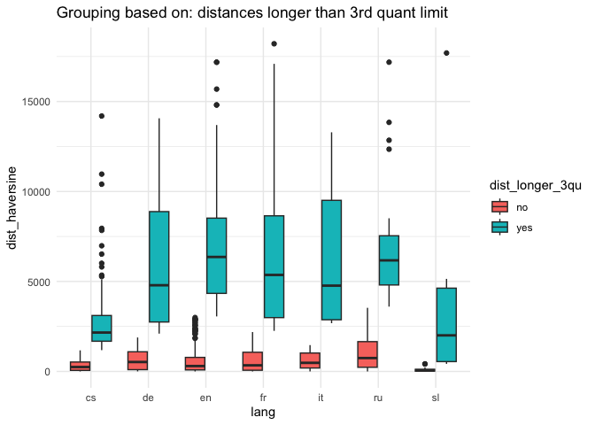

# 01 geodata exploration

## Explore directions of from_to formula

Read data as a table

``` r
formulas <- read.csv("../data/formulas_table.csv")
glimpse(formulas)
```

    Rows: 1,255
    Columns: 14
    $ lang           <chr> "cs", "cs", "cs", "cs", "cs", "cs", "cs", "cs", "cs", "…
    $ doc_key        <chr> "0001_0001-0001-0000-0008-0000", "0036_0001-0000-0000-0…
    $ triplet_id     <int> 1, 1, 2, 1, 2, 1, 1, 1, 2, 1, 2, 3, 1, 1, 1, 1, 1, 1, 1…
    $ from_id        <chr> "Q1497", "Q584", "Q1410", "Q155975", "Q155975", "Q545",…
    $ to_id          <chr> "Q668", "Q545", "Q545", "Q1887287", "Q1085", "Q13924", …
    $ text           <chr> "od břehů širých otce Missisipi až k Indu", "od Pyramid…
    $ from_placename <chr> "Mississippi River", "Rhine", "Gibraltar", "Kutná Hora"…
    $ from_type      <chr> "default", "river", "default", "default", "default", "d…
    $ from_latitude  <dbl> 29.15360, 47.66620, 36.14000, 49.94844, 49.94844, 58.00…
    $ from_longitude <dbl> -89.250800, 9.178600, -5.350000, 15.268226, 15.268226, …
    $ to_placename   <chr> "India", "Baltic Sea", "Baltic Sea", "Malešov", "Prague…
    $ to_type        <chr> "country", "default", "default", "default", "default", …
    $ to_latitude    <dbl> 22.80000, 58.00000, 58.00000, 49.91107, 50.08750, 42.77…
    $ to_longitude   <dbl> 83.00000, 20.00000, 20.00000, 15.22440, 14.42139, 15.42…

N formulas per language

``` r
formulas %>% 
  count(lang, sort = T)
```

      lang   n
    1   cs 341
    2   en 313
    3   fr 299
    4   ru 189
    5   de  63
    6   it  26
    7   sl  24

### types

total

``` r
formulas %>% 
  mutate(type_pair = paste0(from_type, " --> ", to_type)) %>% 
  count(type_pair, sort = T)
```

                     type_pair   n
    1      default --> default 673
    2          river --> river 105
    3        river --> default  72
    4    mountain --> mountain  63
    5      default --> country  58
    6        default --> river  58
    7     mountain --> default  44
    8      country --> default  42
    9     default --> mountain  34
    10     country --> country  30
    11      mountain --> river  13
    12         default --> sea   8
    13      river --> mountain   8
    14        mountain --> sea   6
    15    mountain --> country   4
    16 continent --> continent   3
    17   continent --> default   3
    18       country --> river   3
    19   default --> continent   3
    20  mountain --> continent   3
    21       river --> country   3
    22         sea --> country   3
    23    country --> mountain   2
    24         country --> sea   2
    25           river --> sea   2
    26        sea --> mountain   2
    27           sea --> river   2
    28   continent --> country   1
    29     continent --> river   1
    30   country --> continent   1
    31     river --> continent   1
    32       sea --> continent   1
    33         sea --> default   1

by language

``` r
formulas %>% 
  mutate(type_pair = paste0(from_type, " --> ", to_type)) %>% 
  group_by(lang) %>% 
  count(type_pair, sort = T) %>% 
  slice_max(order_by = n, n = 5) %>% 
  ungroup() %>% 
  mutate(type_pair = paste0(type_pair, " (", n, ")")) %>% 
  group_by(lang) %>% 
  mutate(top_list = paste0(type_pair, collapse = " <br> ")) %>% 
  select(-n, -type_pair) %>% 
  ungroup() %>% 
  distinct() %>% 
  #pivot_wider(names_from = lang, values_from = top_list) %>% 
  knitr::kable(escape = F)
```

<table data-quarto-postprocess="true">
<colgroup>
<col style="width: 50%" />
<col style="width: 50%" />
</colgroup>
<thead>
<tr class="header">
<th style="text-align: left;" data-quarto-table-cell-role="th">lang</th>
<th style="text-align: left;"
data-quarto-table-cell-role="th">top_list</th>
</tr>
</thead>
<tbody>
<tr class="odd">
<td style="text-align: left;">cs</td>
<td style="text-align: left;">default --&gt; default (128)<br />
mountain --&gt; mountain (50)<br />
river --&gt; river (25)<br />
river --&gt; default (20)<br />
mountain --&gt; default (19)</td>
</tr>
<tr class="even">
<td style="text-align: left;">de</td>
<td style="text-align: left;">default --&gt; default (43)<br />
river --&gt; river (8)<br />
default --&gt; river (3)<br />
country --&gt; country (2)<br />
default --&gt; country (2)</td>
</tr>
<tr class="odd">
<td style="text-align: left;">en</td>
<td style="text-align: left;">default --&gt; default (182)<br />
default --&gt; country (23)<br />
default --&gt; river (20)<br />
river --&gt; river (20)<br />
country --&gt; country (16)</td>
</tr>
<tr class="even">
<td style="text-align: left;">fr</td>
<td style="text-align: left;">default --&gt; default (199)<br />
river --&gt; river (30)<br />
river --&gt; default (13)<br />
country --&gt; default (12)<br />
default --&gt; country (12)</td>
</tr>
<tr class="odd">
<td style="text-align: left;">it</td>
<td style="text-align: left;">default --&gt; default (12)<br />
mountain --&gt; default (4)<br />
default --&gt; river (2)<br />
river --&gt; default (2)<br />
river --&gt; river (2)</td>
</tr>
<tr class="even">
<td style="text-align: left;">ru</td>
<td style="text-align: left;">default --&gt; default (93)<br />
river --&gt; default (20)<br />
river --&gt; river (19)<br />
default --&gt; river (14)<br />
country --&gt; default (9)</td>
</tr>
<tr class="odd">
<td style="text-align: left;">sl</td>
<td style="text-align: left;">default --&gt; default (16)<br />
default --&gt; mountain (2)<br />
mountain --&gt; sea (2)<br />
river --&gt; default (2)<br />
default --&gt; river (1)<br />
river --&gt; river (1)</td>
</tr>
</tbody>
</table>

### from-to places

``` r
formulas %>% 
  mutate(from_to_pair = paste0(from_placename, " --> ", to_placename)) %>% 
  count(from_to_pair, sort = T) %>% 
  head(20)
```

                              from_to_pair n
    1  Giant Mountains --> Bohemian Forest 9
    2  Bohemian Forest --> Tatra Mountains 8
    3          Baltic Sea --> Adriatic Sea 6
    4                   Gotha --> Eisenach 6
    5                   Moravia --> Prague 5
    6                Bordeaux --> Narbonne 4
    7              Bratton --> Porlock Bay 4
    8                   France --> England 4
    9               Alps --> Pas-de-Calais 3
    10                   Beersheba --> Dan 3
    11  Bohemian Forest --> Ural Mountains 3
    12                  Canada --> Georgia 3
    13                 Florence --> Altona 3
    14         Giant Mountains --> Moravia 3
    15                      Paris --> Rome 3
    16             River Feale --> Kenmare 3
    17              River Thames --> Tiber 3
    18                       Rome --> Rome 3
    19          Sněžka --> Bohemian Forest 3
    20 Tatra Mountains --> Bohemian Forest 3

By language

``` r
formulas %>% 
  mutate(from_to_pair = paste0(from_placename, " --> ", to_placename)) %>% 
  group_by(lang) %>% 
  count(from_to_pair, sort = T) %>% 
  slice_max(order_by = n, n = 5, with_ties = F)
```

    # A tibble: 35 × 3
    # Groups:   lang [7]
       lang  from_to_pair                            n
       <chr> <chr>                               <int>
     1 cs    Giant Mountains --> Bohemian Forest     9
     2 cs    Bohemian Forest --> Tatra Mountains     8
     3 cs    Baltic Sea --> Adriatic Sea             6
     4 cs    Moravia --> Prague                      5
     5 cs    Bohemian Forest --> Ural Mountains      3
     6 de    Gotha --> Eisenach                      6
     7 de    Florence --> Altona                     3
     8 de    Aachen --> Tczew                        1
     9 de    Adige --> Rhine                         1
    10 de    Amsterdam --> Lübeck                    1
    # ℹ 25 more rows

### maps test

``` r
library(sf)
```

    Linking to GEOS 3.11.0, GDAL 3.5.3, PROJ 9.1.0; sf_use_s2() is TRUE

``` r
library(rnaturalearth)
```

    Warning: package 'rnaturalearth' was built under R version 4.3.1

``` r
library(rnaturalearthdata)
```

    Warning: package 'rnaturalearthdata' was built under R version 4.3.3


    Attaching package: 'rnaturalearthdata'

    The following object is masked from 'package:rnaturalearth':

        countries110

``` r
library(ggrepel)
```

    Warning: package 'ggrepel' was built under R version 4.3.1

some x to y

``` r
f <- formulas %>% 
  filter(lang == "sl") %>% 
  #sample_n(10) %>% 
  mutate(f_id = row_number()) %>% 
  select(f_id, text,
         from_placename, to_placename, 
         from_latitude, to_latitude, 
         from_longitude, to_longitude
         ) 

from <- f %>% 
  select(f_id, text, from_placename, from_latitude, from_longitude) %>% 
  rename(placename = from_placename,
         latitude = from_latitude,
         longitude = from_longitude)

to <- f %>% 
  select(f_id, text, to_placename, to_latitude, to_longitude) %>% 
  rename(placename = to_placename,
         latitude = to_latitude,
         longitude = to_longitude)


# merge in a longer table
from_to <- rbind(from, to)


glimpse(f)
```

    Rows: 24
    Columns: 8
    $ f_id           <int> 1, 2, 3, 4, 5, 6, 7, 8, 9, 10, 11, 12, 13, 14, 15, 16, …
    $ text           <chr> "Od Taga pa do Evfrata", "Od bistre Bosne do Savine", "…
    $ from_placename <chr> "Tagus River", "Bosnia", "Bethlehem", "Trieste", "Trigl…
    $ to_placename   <chr> "Euphrates", "Sava", "Calvary", "Monfalcone", "Adriatic…
    $ from_latitude  <dbl> 38.85250, 44.16000, 31.70444, 45.65028, 46.37833, 46.37…
    $ to_latitude    <dbl> 31.00430, 44.83167, 31.77861, 45.80000, 42.77583, 42.77…
    $ from_longitude <dbl> -9.01370, 17.78000, 35.20611, 13.77028, 13.83667, 13.83…
    $ to_longitude   <dbl> 47.442000, 20.449722, 35.229444, 13.533333, 15.426111, …

``` r
glimpse(from_to)
```

    Rows: 48
    Columns: 5
    $ f_id      <int> 1, 2, 3, 4, 5, 6, 7, 8, 9, 10, 11, 12, 13, 14, 15, 16, 17, 1…
    $ text      <chr> "Od Taga pa do Evfrata", "Od bistre Bosne do Savine", "Od Be…
    $ placename <chr> "Tagus River", "Bosnia", "Bethlehem", "Trieste", "Triglav", …
    $ latitude  <dbl> 38.85250, 44.16000, 31.70444, 45.65028, 46.37833, 46.37833, …
    $ longitude <dbl> -9.01370, 17.78000, 35.20611, 13.77028, 13.83667, 13.83667, …

``` r
# f
# from_to

err <- f[f$from_latitude == f$to_latitude| f$from_longitude == f$to_longitude, ]
```

``` r
ggplot(world) +
  geom_sf() +
  coord_sf(xlim = c(-25, 90), ylim = c(-35,70), expand = FALSE) + 
  geom_point(data = from_to, aes(x = longitude, y = latitude), size = 1, 
       shape = 23, fill = "darkviolet") + 
  geom_curve(data = f %>% 
               filter(!f_id %in% err$f_id), 
             aes(x = from_longitude, y = from_latitude,
                           xend = to_longitude, yend = to_latitude),
             linewidth = 0.5, curvature = 0.2, 
             colour = "darkviolet", alpha = 0.7) +
  geom_text_repel(data = from_to, 
                  aes(x = longitude, y = latitude, label = placename), 
                  size = 2.5, col = "black", fontface = "bold") 
```

    Warning: ggrepel: 40 unlabeled data points (too many overlaps). Consider
    increasing max.overlaps


