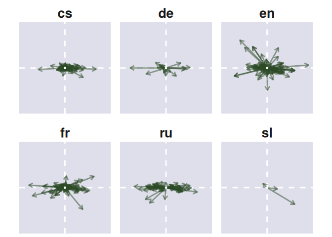
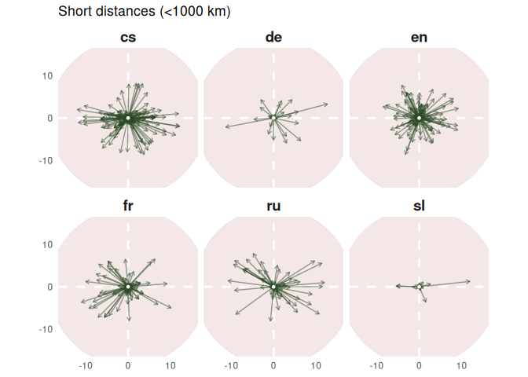
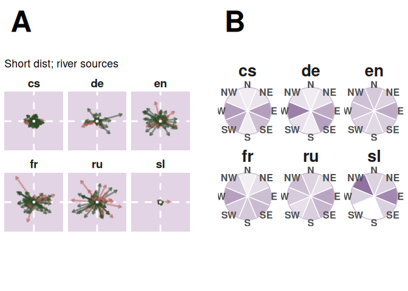
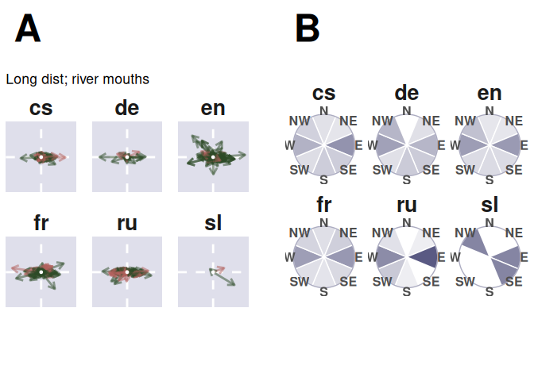
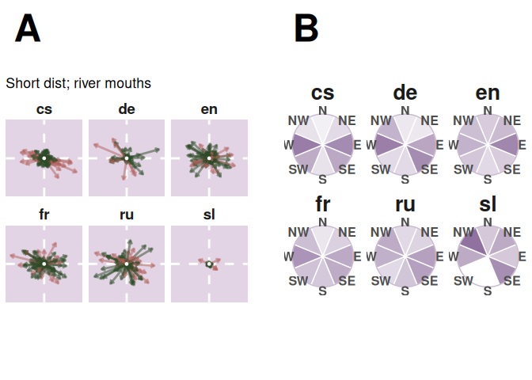
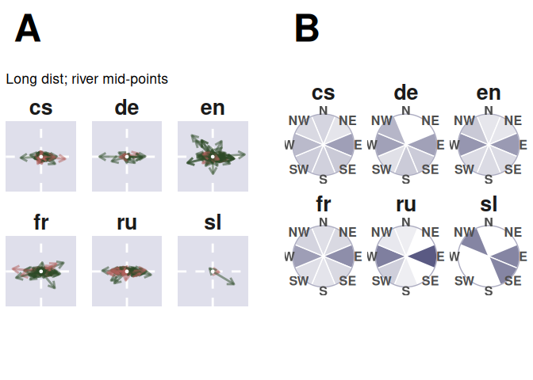
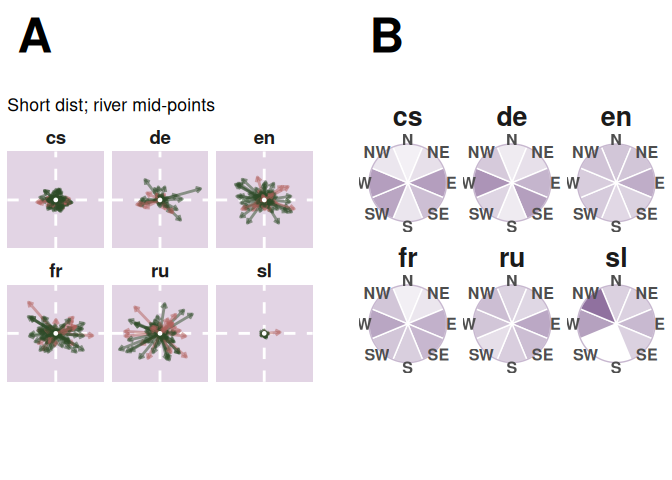

# 02 clock plots


# Clock / compass plots

Load data & calculate distances

    # A tibble: 5 × 5
      lang  text                        from_placename to_placename dist_haversine
      <chr> <chr>                       <chr>          <chr>                 <dbl>
    1 ru    Из Назарета в Вифлеем       Nazareth       Bethlehem              111.
    2 ru    от Вислы до самой Камы      Vistula        Kama                  2065.
    3 fr    de Berlin à Paris           Berlin         Paris                  877.
    4 en    From Maine to utmost Oregon Maine          Oregon                4012.
    5 en    From Cork to Timbuctoo      Cork           Timbuktu              3940.

## calculate coordinates

``` r
formulas_nc <- formulas_d %>% 
  # calculate new coordinates
  mutate(x1_0 = 0.0,
         y1_0 = 0.0,
         
         x2_0 = to_longitude - from_longitude,
         y2_0 = to_latitude - from_latitude)

glimpse(formulas_nc)
```

    Rows: 1,061
    Columns: 28
    $ lang             <chr> "cs", "cs", "cs", "cs", "cs", "cs", "cs", "cs", "cs",…
    $ doc_key          <chr> "0001_0001-0001-0000-0008-0000", "0036_0001-0000-0000…
    $ from_id          <chr> "Q1497", "Q37200", "Q1410", "Q155975", "Q155975", "Q5…
    $ to_id            <chr> "Q668", "Q584", "Q545", "Q1887287", "Q1085", "Q13924"…
    $ text             <chr> "od břehů širých otce Missisipi až k Indu", "od Pyram…
    $ author_name      <chr> "Albert, Eduard", "Breska, Alfons", "Breska, Alfons",…
    $ year_birth       <int> 1841, 1873, 1873, 1857, 1857, 1836, 1836, 1836, 1836,…
    $ year_death       <int> 1900, 1946, 1946, 1890, 1890, 1905, 1905, 1905, 1905,…
    $ from_placename   <chr> "Mississippi River", "Great Pyramid of Giza", "Gibral…
    $ from_latitude    <dbl> 29.15360, 29.97915, 36.14000, 49.94844, 49.94844, 58.…
    $ from_longitude   <dbl> -89.250800, 31.134220, -5.350000, 15.268226, 15.26822…
    $ from_type        <chr> "river", "default", "region", "city", "city", "sea", …
    $ from_type_d      <chr> "river", "default", "land", "city", "city", "sea", "m…
    $ to_placename     <chr> "India", "Rhine", "Baltic Sea", "Malešov", "Prague", …
    $ to_latitude      <dbl> 22.80000, 47.66620, 58.00000, 49.91107, 50.08750, 42.…
    $ to_longitude     <dbl> 83.000000, 9.178600, 20.000000, 15.224397, 14.421389,…
    $ to_type          <chr> "country", "river", "sea", "city", "city", "sea", "mo…
    $ to_type_d        <chr> "country", "river", "sea", "city", "city", "sea", "mo…
    $ text_long        <chr> " plemene lidského jsem poznal , pletě# všech pásem :…
    $ id_short         <chr> "cs-9", "cs-1412", "cs-1412", "cs-2509", "cs-2509", "…
    $ dist_haversine   <dbl> 14194.729, 2720.229, 3062.973, 5.213, 62.519, 1724.57…
    $ dist_longer_1k   <chr> "long", "long", "long", "short", "short", "long", "sh…
    $ mean_dist        <dbl> 1053.702, 1053.702, 1053.702, 1053.702, 1053.702, 105…
    $ dist_longer_mean <chr> "long", "long", "long", "short", "short", "long", "sh…
    $ x1_0             <dbl> 0, 0, 0, 0, 0, 0, 0, 0, 0, 0, 0, 0, 0, 0, 0, 0, 0, 0,…
    $ y1_0             <dbl> 0, 0, 0, 0, 0, 0, 0, 0, 0, 0, 0, 0, 0, 0, 0, 0, 0, 0,…
    $ x2_0             <dbl> 172.250800000, -21.955620000, 25.350000000, -0.043829…
    $ y2_0             <dbl> -6.353600e+00, 1.768705e+01, 2.186000e+01, -3.737108e…

# Long distances

## Fig. 3



# short distances



## Fig. 4: short dist based on mean


# Fig. 5: most common places

Most common places, map background & transparent compases

    # A tibble: 24 × 3
       placename            type         n_corpora
       <chr>                <chr>            <int>
     1 Athens               ancient city         5
     2 Baltic Sea           sea                  5
     3 Cairo                city                 5
     4 Carpathian Mountains mountain             5
     5 Danube               river                5
     6 Euphrates            river                5
     7 Ganges               river                5
     8 Paris                city                 5
     9 Rhine                river                5
    10 Rome                 city                 5
    # ℹ 14 more rows

## map

Locations mentioned in 4 or 5 corpora


``` r
# helper map 

ggplot(world) +
  geom_sf(fill = "cornsilk1",
          color = "cornsilk4",
          linewidth = 1
          ) +
  coord_sf(xlim = c(-15, 68), ylim = c(27,62), expand = FALSE) + 
  
  geom_point(data = pl_coord, aes(x = long, y = lat),
             size = 1, alpha = 0.9, color = "violetred4") + 
  theme(panel.grid.major = element_line(color = "grey60", 
                                        #linetype = "dashed", 
                                        linewidth = 0.1), 
        panel.background = element_rect(fill = "aliceblue"),
        panel.border = element_rect(color = "grey60"))  
  

# ggsave(file = "../plots/3.png", plot = last_plot(), 
#        bg = "white",
#        dpi = 300, width = 20, height = 10)
```

## compasses

Compasses for the places appeared in 4 or 5 corpora

``` r
fixed_length <- 100

freq_coord %>% 
  # filter only from places
  mutate(base_place = ifelse(from_placename %in% freq_ranks$placename, 
                             from_placename, "")) %>% 
  filter(base_place != "") %>% 
  
  # distances (clock handle) length normalization:
  # calculate vector length (hypotenuse) & normalize it
  mutate(
    # hypotenuse
    vec_len = sqrt(x2_0^2 + y2_0^2),
    
    # norm
    x2_norm = (x2_0 / vec_len) * fixed_length,
    y2_norm = (y2_0 / vec_len) * fixed_length
         ) %>% 
  
  # plot
  ggplot() + 
  
  annotate("point", x = 0, y = 0, size = 120,
           alpha = 0.4,
           fill = met.brewer("Cassatt1")[5],
           colour = met.brewer("Cassatt1")[5]) +

  geom_hline(yintercept = 0, lty = 2, colour = "white", 
             linewidth = 1) + 
  geom_vline(xintercept = 0, lty = 2, colour = "white", 
             linewidth = 1) + 
  
  geom_segment(aes(x = x1_0, xend = x2_norm,
                   y = y1_0, yend = y2_norm,
                   color = grouping), 
               #colour = met.brewer("Cassatt2")[9],
               arrow = arrow(length = unit(7, "pt")),
               size = 2,
               alpha = 1) + 
  coord_equal() + 
  facet_wrap(~base_place, ncol = 3) + 
  scale_color_manual(values = c(met.brewer("Cassatt2")[9], 
                                met.brewer("Cassatt1")[1])) +
  scale_x_continuous(limits = c(-120, 120)) + 
  scale_y_continuous(limits = c(-120, 120)) + 
  
  annotate("point", x = 0, y = 0, size = 7,
           fill = "violetred4", colour = "violetred4") + 
  
  theme(# plot.background = element_blank(),
        panel.grid.major = element_blank(),
        panel.grid.minor = element_blank(),
        panel.border = element_blank(), 
        axis.text = element_blank(), 
        axis.title = element_blank(),
        strip.text.x = element_text(size = 14, face = "bold"), 
        
        plot.background = element_rect(fill = "transparent",
                                       colour = NA_character_),
        panel.background = element_rect(fill = "transparent", 
                                        colour = NA_character_))
```

    Warning: Using `size` aesthetic for lines was deprecated in ggplot2 3.4.0.
    ℹ Please use `linewidth` instead.

    Warning: Removed 1 row containing missing values or values outside the scale range
    (`geom_segment()`).


``` r
# ggsave(file = "../plots/3_1.png", plot = last_plot(),
#        bg = "transparent",
#        dpi = 300, width = 15, height = 39)
```

------------------------------------------------------------------------

## Additional

### Rivers

Read the file with additional coordinates for rivers

    Rows: 114 Columns: 11
    ── Column specification ────────────────────────────────────────────────────────
    Delimiter: ","
    chr (3): id, placename, type
    dbl (8): latitude, longitude, source_lat, source_lon, mouth_lat, mouth_lon, ...

    ℹ Use `spec()` to retrieve the full column specification for this data.
    ℹ Specify the column types or set `show_col_types = FALSE` to quiet this message.

``` r
glimpse(rivers)

glimpse(formulas_d)
```

Create 3 different sets: with rivers coords for source, mouths, or mid

``` r
upd_coord <- function(rivers_subset, formulas_df) {
  # attach new long and lat
  formulas_upd <- formulas_df %>% 
    left_join(rivers_subset %>% rename(from_id = id), by = "from_id") %>% 
    mutate(from_latitude = ifelse(!is.na(latitude),
                                  latitude, from_latitude),
           from_longitude = ifelse(!is.na(longitude),
                                  longitude, from_longitude)) %>% 
    select(-c(latitude, longitude)) %>% 
    left_join(rivers_subset %>% rename(to_id = id), by = "to_id") %>% 
    mutate(to_latitude = ifelse(!is.na(latitude),
                                latitude, to_latitude),
           to_longitude = ifelse(!is.na(longitude),
                                 longitude, to_longitude)) %>% 
    select(-c(latitude, longitude))
  
  # recalc centralized points
  formulas_upd <- formulas_upd %>% 
    mutate(x1_0 = 0.0,
           y1_0 = 0.0,
           
           x2_0 = to_longitude - from_longitude,
           y2_0 = to_latitude - from_latitude)

  return(formulas_upd)
}


# only sources

# for all rivers get only sources
rivers_source <- rivers %>% 
  select(id, source_lat, source_lon) %>% 
  rename(latitude = source_lat,
         longitude = source_lon)

fr_sources <- upd_coord(rivers_source, formulas_d)

# glimpse(fr_sources)

# only mouths coordinates

# for all rivers get only sources
rivers_mouth <- rivers %>% 
  select(id, mouth_lat, mouth_lon) %>% 
  rename(latitude = mouth_lat,
         longitude = mouth_lon)

fr_mouths <- upd_coord(rivers_mouth, formulas_d)

# glimpse(fr_mouths)

# only mid-point coordinates

# for all rivers get only sources
rivers_mid <- rivers %>% 
  select(id, mid_lat, mid_lon) %>% 
  rename(latitude = mid_lat,
         longitude = mid_lon)

fr_mid <- upd_coord(rivers_mid, formulas_d)
```

Build the clock plots again (quick fn, not rendered)

``` r
long_dist_pizza <- function(formulas_d) {

  formulas_d <- formulas_d %>% 
    mutate(angle_east_deg = atan2(y2_0, x2_0) * 180 / pi,
           angle_north_deg = (90 - angle_east_deg + 360) %% 360) %>% 
    mutate(
      compass = case_when(
        angle_north_deg < 22.5 | angle_north_deg >= 337.5 ~ "N",
        angle_north_deg < 67.5  ~ "NE",
        angle_north_deg < 112.5 ~ "E",
        angle_north_deg < 157.5 ~ "SE",
        angle_north_deg < 202.5 ~ "S",
        angle_north_deg < 247.5 ~ "SW",
        angle_north_deg < 292.5 ~ "W",
        TRUE                    ~ "NW"
      )
    ) %>% 
    mutate(
      compass = factor(
        compass,
        levels = c("N", "NE", "E", "SE", "S", "SW", "W", "NW")
      )
    )
  
  # percentages
  dist_mean <- formulas_d %>% 
    group_by(lang) %>% 
    summarise(dist_mean = mean(dist_haversine),
              .groups = "drop")
  
  totals <- formulas_d %>% 
    left_join(dist_mean, by = "lang") %>% 
    mutate(dist_longer_mean = ifelse(dist_haversine > dist_mean, "long", "short")) %>% 
    count(lang, dist_longer_mean) %>% 
    mutate(lang_d = paste0(lang, "_", dist_longer_mean)) %>% 
    rename(total_f = n)
  
  x <- formulas_d %>% 
    left_join(dist_mean, by = "lang") %>% 
    mutate(dist_longer_mean = ifelse(dist_haversine > dist_mean, "long", "short")) %>% 
    mutate(lang_d = paste0(lang, "_", dist_longer_mean)) %>% 
    group_by(lang_d) %>% 
    count(compass) %>% 
    left_join(totals, by = "lang_d") %>% 
    mutate(perc = (n / total_f)) %>% 
    ungroup() %>% 
    mutate(value = 1)  
    
  
  long_dist_pizza_p <- x %>% 
    filter(dist_longer_mean == "long") %>% 
    ggplot(aes(x = compass, y = value)) + 
      geom_col(width = 1,
             position = "fill", colour = "white",
             fill = met.brewer("Cassatt1")[8],
             aes(alpha = perc)) + 
      facet_wrap(~lang) + 
      labs(alpha = "%") + 
      geom_hline(yintercept = 1.0, colour = met.brewer("Cassatt1")[8], alpha = 0.5) + 
      theme(
        panel.grid = element_blank(),
        axis.title = element_blank(),
        axis.text.y = element_blank(),
        strip.text = element_text(face = "bold", size = 20),
        #legend.position = "bottom",
        legend.text = element_text(size = 14),
        legend.title = element_text(size = 14),
        axis.text.x = element_text(face = "bold", size = 12)
        ) + 
      coord_polar(start = -pi/8) 
  
  return(long_dist_pizza_p)
}
```

``` r
short_dist_pizza <- function(formulas_d) {

  formulas_d <- formulas_d %>% 
    mutate(angle_east_deg = atan2(y2_0, x2_0) * 180 / pi,
           angle_north_deg = (90 - angle_east_deg + 360) %% 360) %>% 
    mutate(
      compass = case_when(
        angle_north_deg < 22.5 | angle_north_deg >= 337.5 ~ "N",
        angle_north_deg < 67.5  ~ "NE",
        angle_north_deg < 112.5 ~ "E",
        angle_north_deg < 157.5 ~ "SE",
        angle_north_deg < 202.5 ~ "S",
        angle_north_deg < 247.5 ~ "SW",
        angle_north_deg < 292.5 ~ "W",
        TRUE                    ~ "NW"
      )
    ) %>% 
    mutate(
      compass = factor(
        compass,
        levels = c("N", "NE", "E", "SE", "S", "SW", "W", "NW")
      )
    )
  
  # percentages
  dist_mean <- formulas_d %>% 
    group_by(lang) %>% 
    summarise(dist_mean = mean(dist_haversine),
              .groups = "drop")
  
  totals <- formulas_d %>% 
    left_join(dist_mean, by = "lang") %>% 
    mutate(dist_longer_mean = ifelse(dist_haversine > dist_mean, "long", "short")) %>% 
    count(lang, dist_longer_mean) %>% 
    mutate(lang_d = paste0(lang, "_", dist_longer_mean)) %>% 
    rename(total_f = n)
  
  x <- formulas_d %>% 
    left_join(dist_mean, by = "lang") %>% 
    mutate(dist_longer_mean = ifelse(dist_haversine > dist_mean, "long", "short")) %>% 
    mutate(lang_d = paste0(lang, "_", dist_longer_mean)) %>% 
    group_by(lang_d) %>% 
    count(compass) %>% 
    left_join(totals, by = "lang_d") %>% 
    mutate(perc = (n / total_f)) %>% 
    ungroup() %>% 
    mutate(value = 1)  
    
  
  short_dist_pizza_p <- x %>% 
    filter(dist_longer_mean == "short") %>% 
    ggplot(aes(x = compass, y = value)) + 
    geom_col(width = 1,
             position = "fill", colour = "white",
             fill = met.brewer("Cassatt2")[3],
             aes(alpha = perc)) + 
    facet_wrap(~lang) + 
    labs(alpha = "%") +
    geom_hline(yintercept = 1.0, colour = met.brewer("Cassatt2")[3], alpha = 0.5) + 
    theme(
        panel.grid = element_blank(),
        axis.title = element_blank(),
        axis.text.y = element_blank(),
        strip.text = element_text(face = "bold", size = 20),
        #legend.position = "bottom",
        legend.text = element_text(size = 14),
        legend.title = element_text(size = 14),
        axis.text.x = element_text(face = "bold", size = 12)
        ) + 
    coord_polar(start = -pi/8) 
  
  return(short_dist_pizza_p)
}
```

``` r
################## sources

# glimpse(fr_sources)

# long
c_long <- clock_long(fr_sources) + ggtitle("Long dist; river sources") + 
  theme(legend.position = "None")
p_long <- long_dist_pizza(fr_sources) + 
  theme(legend.position = "None")


plot_grid(c_long, NA, p_long,
          nrow = 1, rel_widths = c(1, 0.1, 1),
          labels = c("A", "", "B"), label_size = 36)
```


``` r
# ggsave("../plots/rivers/long_sources.png", plot = last_plot(),
#        width = 20, height = 7, bg = "white", dpi = 300)

# short
c_short <- clock_short(fr_sources) + ggtitle("Short dist; river sources") + 
  theme(legend.position = "None")
p_short <- short_dist_pizza(fr_sources) + 
  theme(legend.position = "None")


plot_grid(c_short, NA, p_short,
          nrow = 1, rel_widths = c(1, 0.1, 1),
          labels = c("A", "", "B"), label_size = 36)
```



``` r
# ggsave("../plots/rivers/short_sources.png", plot = last_plot(),
#        width = 20, height = 7, bg = "white", dpi = 300)

###################### mouths

# glimpse(fr_mouths)

# long
c_long <- clock_long(fr_mouths) + ggtitle("Long dist; river mouths") + 
  theme(legend.position = "None")
p_long <- long_dist_pizza(fr_mouths)  + 
  theme(legend.position = "None")


plot_grid(c_long, NA, p_long,
          nrow = 1, rel_widths = c(1, 0.1, 1),
          labels = c("A", "", "B"), label_size = 36)
```



``` r
# ggsave("../plots/rivers/long_mouths.png", plot = last_plot(),
#        width = 20, height = 7, bg = "white", dpi = 300)

# short
c_short <- clock_short(fr_mouths) + ggtitle("Short dist; river mouths") + 
  theme(legend.position = "None")
p_short <- short_dist_pizza(fr_mouths) + 
  theme(legend.position = "None")


plot_grid(c_short, NA, p_short,
          nrow = 1, rel_widths = c(1, 0.1, 1),
          labels = c("A", "", "B"), label_size = 36)
```



``` r
# ggsave("../plots/rivers/short_mouths.png", plot = last_plot(),
#        width = 20, height = 7, bg = "white", dpi = 300)

################################ mid points
# glimpse(fr_mid)

# long
c_long <- clock_long(fr_mid) + ggtitle("Long dist; river mid-points") + 
  theme(legend.position = "None")
p_long <- long_dist_pizza(fr_mid) + 
  theme(legend.position = "None")


plot_grid(c_long, NA, p_long,
          nrow = 1, rel_widths = c(1, 0.1, 1),
          labels = c("A", "", "B"), label_size = 36)
```



``` r
# ggsave("../plots/rivers/long_mid.png", plot = last_plot(),
#        width = 20, height = 7, bg = "white", dpi = 300)

# short
c_short <- clock_short(fr_mid) + ggtitle("Short dist; river mid-points") + 
  theme(legend.position = "None")
p_short <- short_dist_pizza(fr_mid) + 
  theme(legend.position = "None")


plot_grid(c_short, NA, p_short,
          nrow = 1, rel_widths = c(1, 0.1, 1),
          labels = c("A", "", "B"), label_size = 36)
```



``` r
# ggsave("../plots/rivers/short_mid.png", plot = last_plot(),
#        width = 20, height = 7, bg = "white", dpi = 300)
```
