# 02 compass plots

# Compass plots

Load data & calculate distances

    # A tibble: 6 × 5
      lang  text                          from_placename to_placename dist_haversine
      <chr> <chr>                         <chr>          <chr>                 <dbl>
    1 cs    od břehů širých otce Missisi… Mississippi R… India              14195.  
    2 cs    od Pyramid k Rýnu , od Gibra… Great Pyramid… Rhine               2720.  
    3 cs    od Gibraltaru k bouřným vlná… Gibraltar      Baltic Sea          3063.  
    4 cs    od Hor Kuten k Malešovu       Kutná Hora     Malešov                5.21
    5 cs    Od Hor Kuten veden k Praze    Kutná Hora     Prague                62.5 
    6 cs    od Baltu až k Adrii           Baltic Sea     Adriatic Sea        1725.  

## calculate coordinates

``` r
formulas_nc <- formulas_d %>% 
  # calculate new coordinates
  mutate(x1_0 = 0.0,
         y1_0 = 0.0,
         
         x2_0 = to_longitude - from_longitude,
         y2_0 = to_latitude - from_latitude)

glimpse(formulas_nc)
```

    Rows: 1,088
    Columns: 24
    $ lang           <chr> "cs", "cs", "cs", "cs", "cs", "cs", "cs", "cs", "cs", "…
    $ doc_key        <chr> "0001_0001-0001-0000-0008-0000", "0036_0001-0000-0000-0…
    $ from_id        <chr> "Q1497", "Q37200", "Q1410", "Q155975", "Q155975", "Q545…
    $ to_id          <chr> "Q668", "Q584", "Q545", "Q1887287", "Q1085", "Q13924", …
    $ text           <chr> "od břehů širých otce Missisipi až k Indu", "od Pyramid…
    $ author_name    <chr> "Albert, Eduard", "Breska, Alfons", "Breska, Alfons", "…
    $ year_birth     <int> 1841, 1873, 1873, 1857, 1857, 1836, 1836, 1836, 1836, 1…
    $ year_death     <int> 1900, 1946, 1946, 1890, 1890, 1905, 1905, 1905, 1905, 1…
    $ from_placename <chr> "Mississippi River", "Great Pyramid of Giza", "Gibralta…
    $ from_latitude  <dbl> 29.15360, 29.97915, 36.14000, 49.94844, 49.94844, 58.00…
    $ from_longitude <dbl> -89.250800, 31.134220, -5.350000, 15.268226, 15.268226,…
    $ from_type      <chr> "river", "default", "region", "city", "city", "sea", "m…
    $ from_type_d    <chr> "river", "default", "land", "city", "city", "sea", "mou…
    $ to_placename   <chr> "India", "Rhine", "Baltic Sea", "Malešov", "Prague", "A…
    $ to_latitude    <dbl> 22.80000, 47.66620, 58.00000, 49.91107, 50.08750, 42.77…
    $ to_longitude   <dbl> 83.000000, 9.178600, 20.000000, 15.224397, 14.421389, 1…
    $ to_type        <chr> "country", "river", "sea", "city", "city", "sea", "moun…
    $ to_type_d      <chr> "country", "river", "sea", "city", "city", "sea", "moun…
    $ dist_haversine <dbl> 14194.729, 2720.229, 3062.973, 5.213, 62.519, 1724.578,…
    $ dist_longer_1k <chr> "long", "long", "long", "short", "short", "long", "shor…
    $ x1_0           <dbl> 0, 0, 0, 0, 0, 0, 0, 0, 0, 0, 0, 0, 0, 0, 0, 0, 0, 0, 0…
    $ y1_0           <dbl> 0, 0, 0, 0, 0, 0, 0, 0, 0, 0, 0, 0, 0, 0, 0, 0, 0, 0, 0…
    $ x2_0           <dbl> 172.250800000, -21.955620000, 25.350000000, -0.04382919…
    $ y2_0           <dbl> -6.353600e+00, 1.768705e+01, 2.186000e+01, -3.737108e-0…

## plot — all

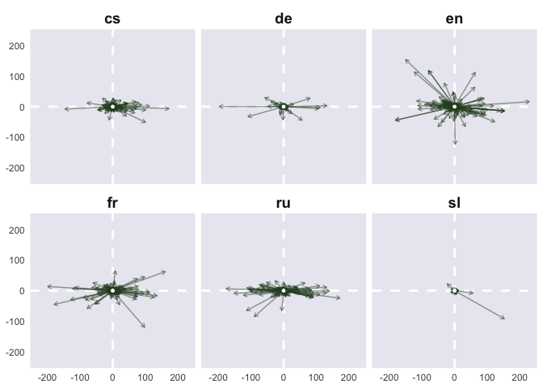

## loc types

### river —\> river

    Warning: Removed 1 row containing missing values or values outside the scale range
    (`geom_segment()`).

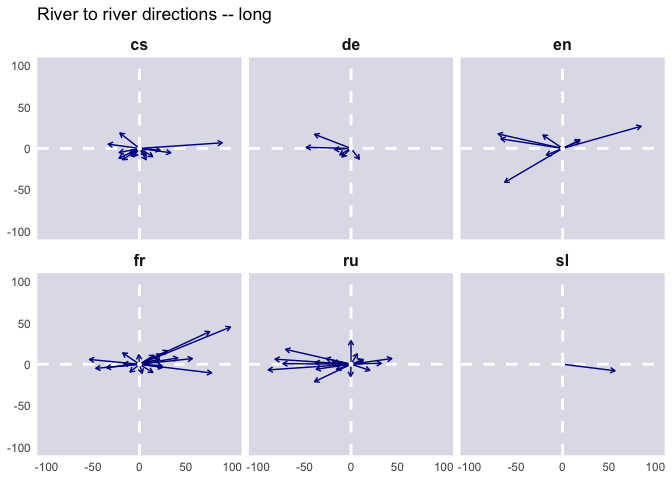


### city —\> city

    Warning: Removed 1 row containing missing values or values outside the scale range
    (`geom_segment()`).

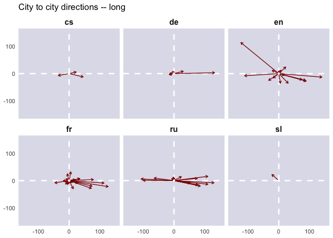


### country –\> country

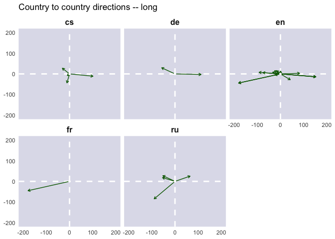

### mountain –\> mountain

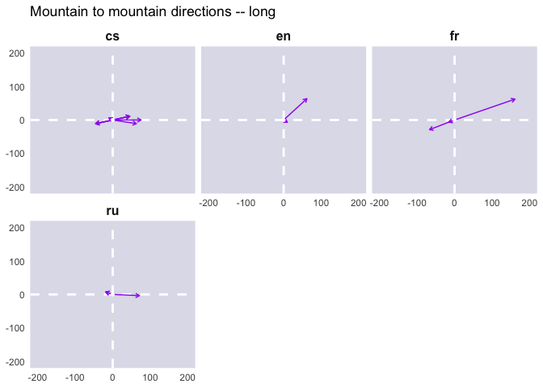

### village (any)

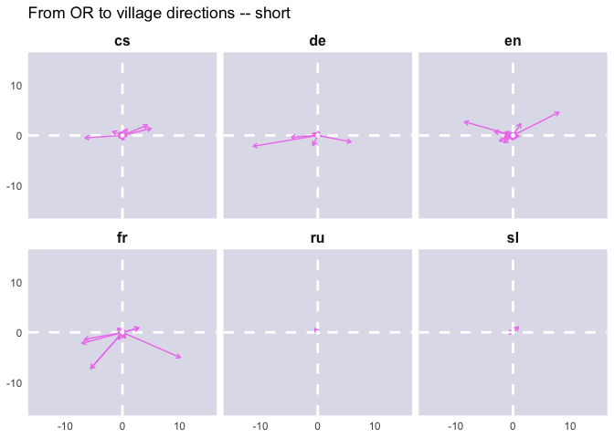

## compass – 1 lang

Use only one corpus to look into different types of directions

### cz

     [1] "city --> city"         "mountain --> mountain" "river --> river"      
     [4] "region --> city"       "country --> country"   "region --> mountain"  
     [7] "city --> river"        "city --> village"      "river --> city"       
    [10] "sea --> sea"           "city part --> city"    "mountain --> region"  
    [13] "mountain --> river"    "river --> mountain"    "village --> city"     

    Warning: Removed 1 row containing missing values or values outside the scale range
    (`geom_segment()`).


NB here longest distances are not only river-river, but mountains

### en

     [1] "city --> city"           "river --> river"        
     [3] "country --> country"     "region --> region"      
     [5] "city --> country"        "region --> city"        
     [7] "village --> village"     "city --> village"       
     [9] "river --> city"          "city --> river"         
    [11] "city part --> city part" "village --> city"       
    [13] "region --> country"      "region --> river"       


### fr

     [1] "city --> city"                 "river --> river"              
     [3] "village --> city"              "ancient city --> city"        
     [5] "city part --> city part"       "region --> city"              
     [7] "region --> region"             "ancient city --> ancient city"
     [9] "river --> city"                "city --> city part"           
    [11] "city --> country"              "island --> city"              
    [13] "mountain --> mountain"        

    Warning: Removed 1 row containing missing values or values outside the scale range
    (`geom_segment()`).

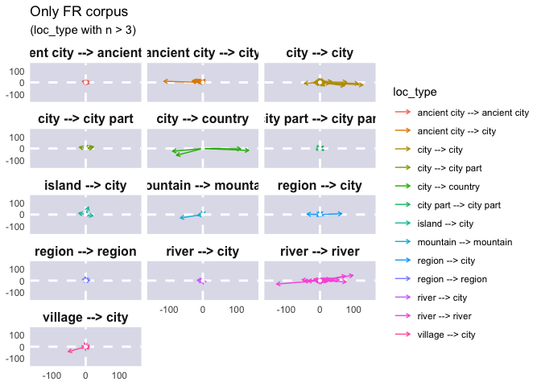

### ru

    [1] "city --> city"           "river --> river"        
    [3] "river --> city"          "city part --> city part"
    [5] "mountain --> mountain"   "city --> country"       
    [7] "country --> country"     "region --> river"       

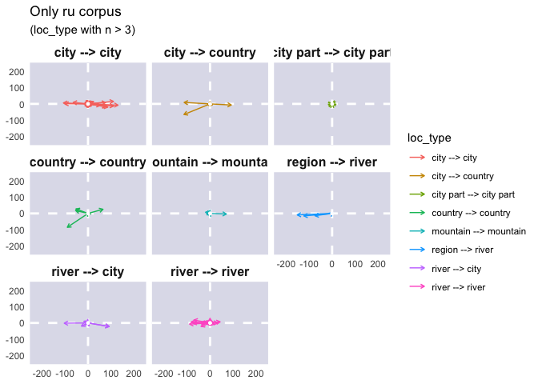

## add short/long distances types

two different plots for long & for short distances

### short dist closer look


### longer dist


Merge two plots in one

### Directions in time

Temporal facets for each corpus: groupings by author’s birth year;
50-years spans

``` r
# fucntion for easier running

time_plot <- function(corpus, lim_x1, lim_x2, lim_y1, lim_y2, point_size) { 
  
  formulas_nc %>% 
  filter(!is.na(year_birth)) %>% 
  mutate(period_birth = floor(year_birth/50)*50,
         period_end = period_birth + 49,
         period = paste0(period_birth, "—", period_end)) %>% 
  filter(lang == corpus) %>% 
  
  ggplot() + 
  annotate("point", x = 0, y = 0, size = point_size, 
           alpha = 0.6, 
           fill = met.brewer("Cassatt1")[5], 
           colour = met.brewer("Cassatt1")[5]) + 
  
  geom_hline(yintercept = 0, lty = 2, colour = "white", 
             linewidth = 1) + 
  geom_vline(xintercept = 0, lty = 2, colour = "white", 
             linewidth = 1) + 
  
  facet_wrap(~period, ncol=6) + 
  
  geom_segment(aes(x = x1_0, xend = x2_0,
                   y = y1_0, yend = y2_0), 
               colour = met.brewer("Cassatt2")[9],
               arrow = arrow(length = unit(4, "pt"))) + 
  scale_x_continuous(limits = c(lim_x1, lim_x2)) + 
  scale_y_continuous(limits = c(lim_y1, lim_y2)) + 
  
  annotate("point", x = 0, y = 0, size = 1,
           fill = "white", colour = "white") + 
  
  theme(plot.background = element_blank(),
        panel.grid.major = element_blank(),
        panel.grid.minor = element_blank(),
        panel.border = element_blank(), 
        #axis.text = element_blank(), 
        axis.title = element_blank(),
        strip.text.x = element_text(size = 12, face = "bold"))
  }
```

Czech corpus:

    Warning: Removed 1 row containing missing values or values outside the scale range
    (`geom_segment()`).


German corpus: there are mostly small distances which are hardly visible
here

    Warning: Removed 1 row containing missing values or values outside the scale range
    (`geom_segment()`).


English: interesting expansion to north and to south, huh? and later to
the north


FR: authors born in the first half of the 19th-c. are colonialists

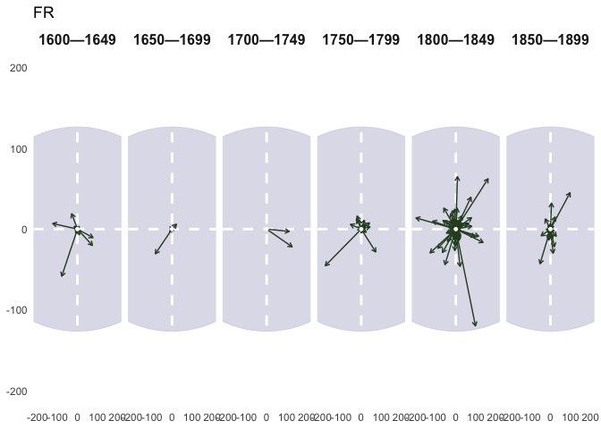

IT: the only case of reducing the scope of from-to

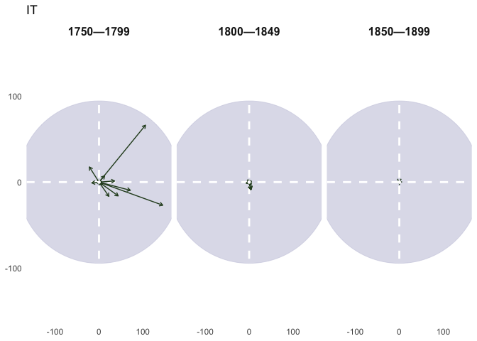

RU: horizontal expansion + caucasus?

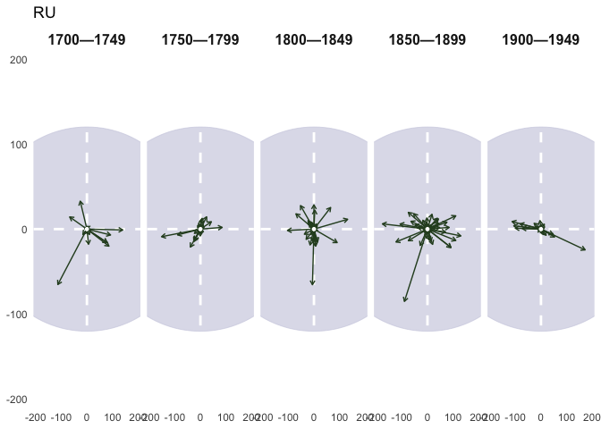

SL: too small (3 longest dist are removed on this plot)

    Warning: Removed 1 row containing missing values or values outside the scale range
    (`geom_segment()`).
    Removed 1 row containing missing values or values outside the scale range
    (`geom_segment()`).
    Removed 1 row containing missing values or values outside the scale range
    (`geom_segment()`).


