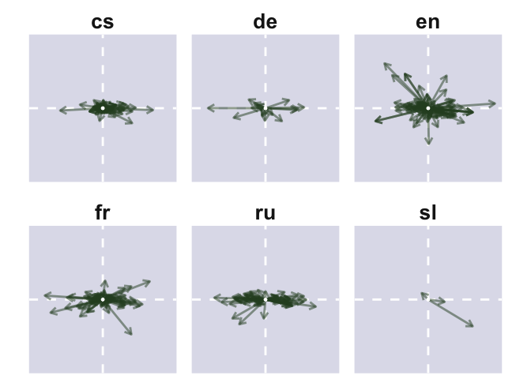
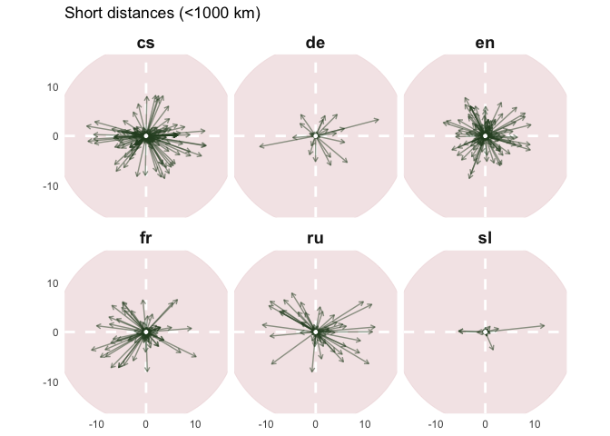
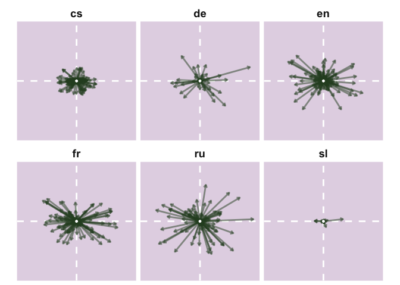
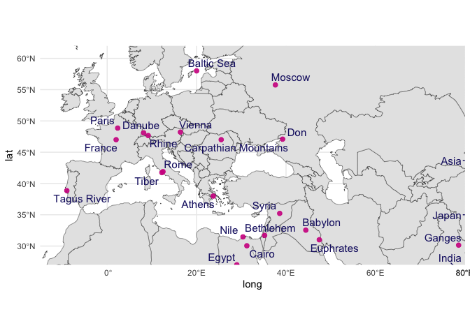
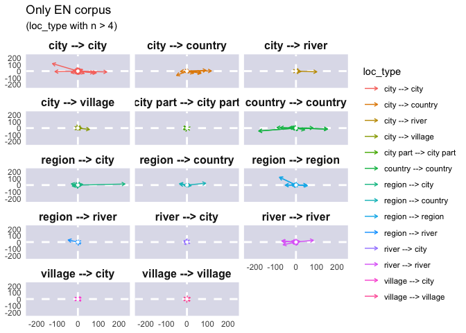
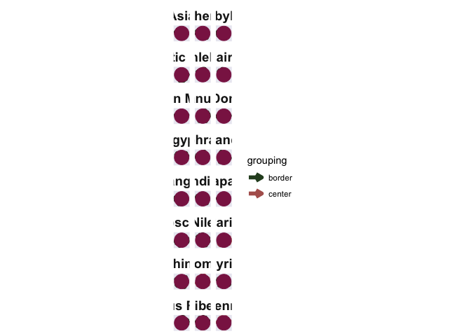
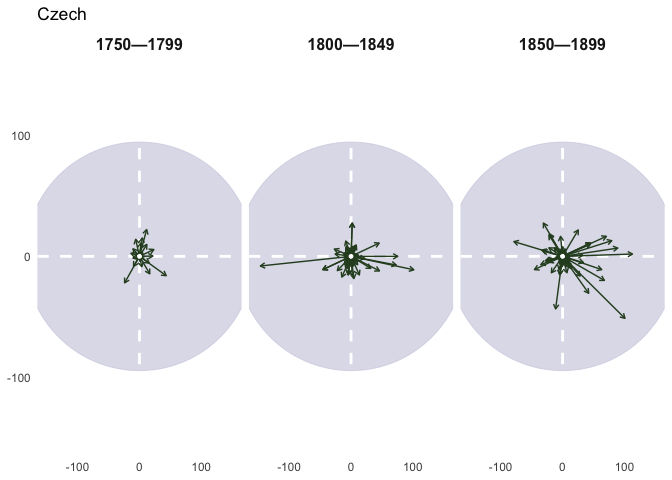
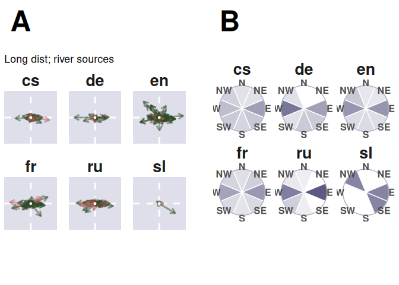
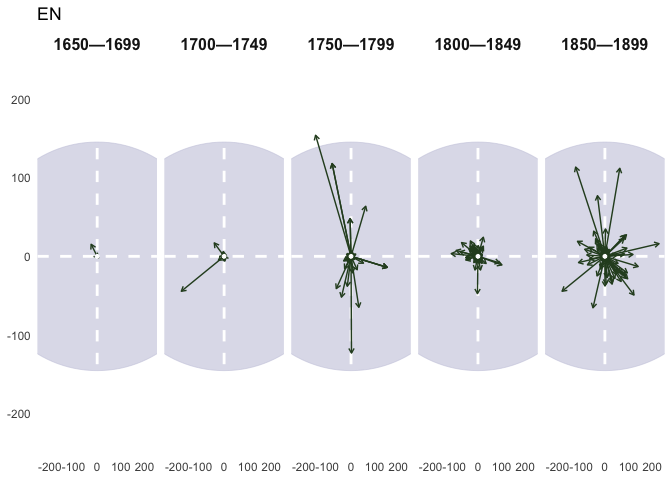
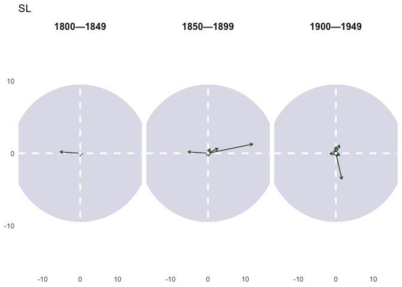

# 02 clock plots

# Clock / compass plots

Load data & calculate distances

    # A tibble: 6 × 5
      lang  text                          from_placename to_placename dist_haversine
      <chr> <chr>                         <chr>          <chr>                 <dbl>
    1 cs    od břehů širých otce Missisi… Mississippi R… India              14195.  
    2 cs    od Pyramid k Rýnu , od Gibra… Great Pyramid… Rhine               2720.  
    3 cs    od Gibraltaru k bouřným vlná… Gibraltar      Baltic Sea          3063.  
    4 cs    od Hor Kuten k Malešovu       Kutná Hora     Malešov                5.21
    5 cs    Od Hor Kuten veden k Praze    Kutná Hora     Prague                62.5 
    6 cs    od Baltu až k Adrii           Baltic Sea     Adriatic Sea        1725.  

## calculate coordinates

``` r
formulas_nc <- formulas_d %>% 
  # calculate new coordinates
  mutate(x1_0 = 0.0,
         y1_0 = 0.0,
         
         x2_0 = to_longitude - from_longitude,
         y2_0 = to_latitude - from_latitude)

glimpse(formulas_nc)
```

    Rows: 1,061
    Columns: 26
    $ lang             <chr> "cs", "cs", "cs", "cs", "cs", "cs", "cs", "cs", "cs",…
    $ doc_key          <chr> "0001_0001-0001-0000-0008-0000", "0036_0001-0000-0000…
    $ from_id          <chr> "Q1497", "Q37200", "Q1410", "Q155975", "Q155975", "Q5…
    $ to_id            <chr> "Q668", "Q584", "Q545", "Q1887287", "Q1085", "Q13924"…
    $ text             <chr> "od břehů širých otce Missisipi až k Indu", "od Pyram…
    $ author_name      <chr> "Albert, Eduard", "Breska, Alfons", "Breska, Alfons",…
    $ year_birth       <int> 1841, 1873, 1873, 1857, 1857, 1836, 1836, 1836, 1836,…
    $ year_death       <int> 1900, 1946, 1946, 1890, 1890, 1905, 1905, 1905, 1905,…
    $ from_placename   <chr> "Mississippi River", "Great Pyramid of Giza", "Gibral…
    $ from_latitude    <dbl> 29.15360, 29.97915, 36.14000, 49.94844, 49.94844, 58.…
    $ from_longitude   <dbl> -89.250800, 31.134220, -5.350000, 15.268226, 15.26822…
    $ from_type        <chr> "river", "default", "region", "city", "city", "sea", …
    $ from_type_d      <chr> "river", "default", "land", "city", "city", "sea", "m…
    $ to_placename     <chr> "India", "Rhine", "Baltic Sea", "Malešov", "Prague", …
    $ to_latitude      <dbl> 22.80000, 47.66620, 58.00000, 49.91107, 50.08750, 42.…
    $ to_longitude     <dbl> 83.000000, 9.178600, 20.000000, 15.224397, 14.421389,…
    $ to_type          <chr> "country", "river", "sea", "city", "city", "sea", "mo…
    $ to_type_d        <chr> "country", "river", "sea", "city", "city", "sea", "mo…
    $ dist_haversine   <dbl> 14194.729, 2720.229, 3062.973, 5.213, 62.519, 1724.57…
    $ dist_longer_1k   <chr> "long", "long", "long", "short", "short", "long", "sh…
    $ mean_dist        <dbl> 1053.702, 1053.702, 1053.702, 1053.702, 1053.702, 105…
    $ dist_longer_mean <chr> "long", "long", "long", "short", "short", "long", "sh…
    $ x1_0             <dbl> 0, 0, 0, 0, 0, 0, 0, 0, 0, 0, 0, 0, 0, 0, 0, 0, 0, 0,…
    $ y1_0             <dbl> 0, 0, 0, 0, 0, 0, 0, 0, 0, 0, 0, 0, 0, 0, 0, 0, 0, 0,…
    $ x2_0             <dbl> 172.250800000, -21.955620000, 25.350000000, -0.043829…
    $ y2_0             <dbl> -6.353600e+00, 1.768705e+01, 2.186000e+01, -3.737108e…

# Long distances

## Fig. 3



# short distances

two different plots for long & for short distances

1000 km threshold



## Fig. 4: short dist based on mean



# Fig. 5: most common places

Most common places, map background & transparent compases

``` r
x <- formulas_nc %>% 
  select(from_placename, from_type, lang) %>% 
  rename(placename = from_placename,
         type = from_type) 

freq_ranks <- formulas_nc %>% 
  select(to_placename, to_type, lang) %>% 
  rename(placename = to_placename,
         type = to_type) %>% 
  rbind(x) %>% 
  distinct() %>% 
  count(placename, type, sort = T) %>% 
  rename(n_corpora = n) %>% 
  filter(n_corpora > 3) # %>% 
  # filter(placename %in% c(
  #   "Baltic Sea", "Tagus River", "Paris", "Rome", "Athens", 
  #   "Nile", "Euphrates", "Babylon", "Bethlehem", 
  #   "Dardanelles", "Don", "Moscow"
  # )) 

freq_ranks
```

    # A tibble: 24 × 3
       placename            type         n_corpora
       <chr>                <chr>            <int>
     1 Athens               ancient city         5
     2 Baltic Sea           sea                  5
     3 Cairo                city                 5
     4 Carpathian Mountains mountain             5
     5 Danube               river                5
     6 Euphrates            river                5
     7 Ganges               river                5
     8 Paris                city                 5
     9 Rhine                river                5
    10 Rome                 city                 5
    # ℹ 14 more rows

## map

Locations mentioned in 4 or 5 corpora

``` r
# load map
world <- ne_countries(scale = "medium", returnclass = "sf")

# europe <- world[which(world$continent == "Europe"),]


x <- freq_coord %>% 
  select(from_id, from_placename, from_latitude, from_longitude, lang) %>% 
  rename(id = from_id,
         placename = from_placename,
         lat = from_latitude,
         long = from_longitude) 


pl_coord <- freq_coord %>% 
  select(to_id, to_placename, to_latitude, to_longitude, lang) %>% 
  rename(id = to_id,
         placename = to_placename,
         lat = to_latitude,
         long = to_longitude) %>% 
  rbind(x) %>% 
  select(-lang) %>% 
  distinct() %>% 
  filter(placename %in% freq_ranks$placename) 

ggplot(world) +
  geom_sf(#fill = "#cbeedb"
          ) +
  coord_sf(xlim = c(-15, 80), ylim = c(27,62), expand = FALSE) + 
  
  geom_point(data = pl_coord, aes(x = long, y = lat), 
             size = 2, alpha = 0.9, color = "violetred") + 
  geom_text_repel(data = pl_coord, 
                  aes(x = long, y = lat, label = placename),
                  size = 4, color = "midnightblue")
```



Background map for the plot



## compasses

Only compasses for the places appeared in 4 or 5 corpora

``` r
fixed_length <- 100

freq_coord %>% 
  # filter only from places
  filter(lang != "it") %>% 
  mutate(base_place = ifelse(from_placename %in% freq_ranks$placename, 
                             from_placename, "")) %>% 
  filter(base_place != "") %>% 
  
  # distances (clock handle) length normalization:
  # calculate vector length (hypotenuse) & normalize it
  mutate(
    # hypotenuse
    vec_len = sqrt(x2_0^2 + y2_0^2),
    
    # norm
    x2_norm = (x2_0 / vec_len) * fixed_length,
    y2_norm = (y2_0 / vec_len) * fixed_length
         ) %>% 
  
  # plot
  ggplot() + 
  
  annotate("point", x = 0, y = 0, size = 120,
           alpha = 0.4,
           fill = met.brewer("Cassatt1")[5],
           colour = met.brewer("Cassatt1")[5]) +

  geom_hline(yintercept = 0, lty = 2, colour = "white", 
             linewidth = 1) + 
  geom_vline(xintercept = 0, lty = 2, colour = "white", 
             linewidth = 1) + 
  
  geom_segment(aes(x = x1_0, xend = x2_norm,
                   y = y1_0, yend = y2_norm,
                   color = grouping), 
               #colour = met.brewer("Cassatt2")[9],
               arrow = arrow(length = unit(7, "pt")),
               size = 2,
               alpha = 1) + 
  coord_equal() + 
  facet_wrap(~base_place, ncol = 3) + 
  scale_color_manual(values = c(met.brewer("Cassatt2")[9], 
                                met.brewer("Cassatt1")[1])) +
  scale_x_continuous(limits = c(-120, 120)) + 
  scale_y_continuous(limits = c(-120, 120)) + 
  
  annotate("point", x = 0, y = 0, size = 7,
           fill = "violetred4", colour = "violetred4") + 
  
  theme(# plot.background = element_blank(),
        panel.grid.major = element_blank(),
        panel.grid.minor = element_blank(),
        panel.border = element_blank(), 
        axis.text = element_blank(), 
        axis.title = element_blank(),
        strip.text.x = element_text(size = 14, face = "bold"), 
        
        plot.background = element_rect(fill = "transparent",
                                       colour = NA_character_),
        panel.background = element_rect(fill = "transparent", 
                                        colour = NA_character_))
```

    Warning: Using `size` aesthetic for lines was deprecated in ggplot2 3.4.0.
    ℹ Please use `linewidth` instead.

    Warning: Removed 1 row containing missing values or values outside the scale range
    (`geom_segment()`).



``` r
# ggsave(file = "../plots/3_1.png", plot = last_plot(),
#        bg = "transparent",
#        dpi = 300, width = 15, height = 39)
```

------------------------------------------------------------------------

## Additional

### Directions in time

Temporal facets for each corpus: groupings by author’s birth year;
50-years spans

``` r
# fucntion for easier running

time_plot <- function(corpus, lim_x1, lim_x2, lim_y1, lim_y2, point_size) { 
  
  formulas_nc %>% 
  filter(!is.na(year_birth)) %>% 
  mutate(period_birth = floor(year_birth/50)*50,
         period_end = period_birth + 49,
         period = paste0(period_birth, "—", period_end)) %>% 
  filter(lang == corpus) %>% 
  
  ggplot() + 
  annotate("point", x = 0, y = 0, size = point_size, 
           alpha = 0.6, 
           fill = met.brewer("Cassatt1")[5], 
           colour = met.brewer("Cassatt1")[5]) + 
  
  geom_hline(yintercept = 0, lty = 2, colour = "white", 
             linewidth = 1) + 
  geom_vline(xintercept = 0, lty = 2, colour = "white", 
             linewidth = 1) + 
  
  facet_wrap(~period, ncol=6) + 
  
  geom_segment(aes(x = x1_0, xend = x2_0,
                   y = y1_0, yend = y2_0), 
               colour = met.brewer("Cassatt2")[9],
               arrow = arrow(length = unit(4, "pt"))) + 
  scale_x_continuous(limits = c(lim_x1, lim_x2)) + 
  scale_y_continuous(limits = c(lim_y1, lim_y2)) + 
  
  annotate("point", x = 0, y = 0, size = 1,
           fill = "white", colour = "white") + 
  
  theme(plot.background = element_blank(),
        panel.grid.major = element_blank(),
        panel.grid.minor = element_blank(),
        panel.border = element_blank(), 
        #axis.text = element_blank(), 
        axis.title = element_blank(),
        strip.text.x = element_text(size = 12, face = "bold"))
  }
```

Czech corpus:

    Warning: Removed 1 row containing missing values or values outside the scale range
    (`geom_segment()`).



German corpus: there are mostly small distances which are hardly visible
here

    Warning: Removed 1 row containing missing values or values outside the scale range
    (`geom_segment()`).



English: interesting expansion to north and to south, huh? and later to
the north



FR: authors born in the first half of the 19th-c. are colonialists


RU: horizontal expansion + caucasus?


SL: too small (3 longest dist are removed on this plot)

    Warning: Removed 1 row containing missing values or values outside the scale range
    (`geom_segment()`).
    Removed 1 row containing missing values or values outside the scale range
    (`geom_segment()`).
    Removed 1 row containing missing values or values outside the scale range
    (`geom_segment()`).


