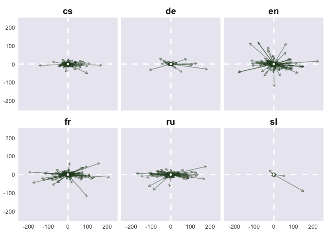
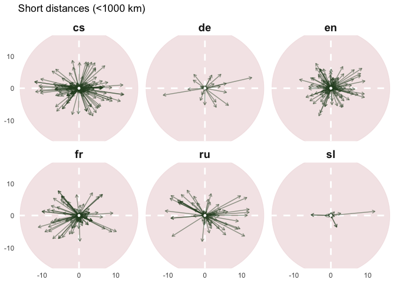

# 02 compass plots

## Compass plots

Load data & calculate distances

    # A tibble: 6 × 5
      lang  text                          from_placename to_placename dist_haversine
      <chr> <chr>                         <chr>          <chr>                 <dbl>
    1 cs    od břehů širých otce Missisi… Mississippi R… India              14195.  
    2 cs    od Pyramid k Rýnu , od Gibra… Rhine          Baltic Sea          1358.  
    3 cs    od Gibraltaru k bouřným vlná… Gibraltar      Baltic Sea          3063.  
    4 cs    od Hor Kuten k Malešovu       Kutná Hora     Malešov                5.21
    5 cs    Od Hor Kuten veden k Praze    Kutná Hora     Prague                62.5 
    6 cs    od Baltu až k Adrii           Baltic Sea     Adriatic Sea        1725.  

### calculate coordinates

``` r
formulas_nc <- formulas_d %>% 
  # calculate new coordinates
  mutate(x1_0 = 0.0,
         y1_0 = 0.0,
         
         x2_0 = to_longitude - from_longitude,
         y2_0 = to_latitude - from_latitude)

glimpse(formulas_nc)
```

    Rows: 1,255
    Columns: 22
    $ lang           <chr> "cs", "cs", "cs", "cs", "cs", "cs", "cs", "cs", "cs", "…
    $ doc_key        <chr> "0001_0001-0001-0000-0008-0000", "0036_0001-0000-0000-0…
    $ from_id        <chr> "Q1497", "Q584", "Q1410", "Q155975", "Q155975", "Q545",…
    $ to_id          <chr> "Q668", "Q545", "Q545", "Q1887287", "Q1085", "Q13924", …
    $ text           <chr> "od břehů širých otce Missisipi až k Indu", "od Pyramid…
    $ author_name    <chr> "Albert, Eduard", "Breska, Alfons", "Breska, Alfons", "…
    $ year_birth     <int> 1841, 1873, 1873, 1857, 1857, 1836, 1836, 1836, 1836, 1…
    $ year_death     <int> 1900, 1946, 1946, 1890, 1890, 1905, 1905, 1905, 1905, 1…
    $ from_placename <chr> "Mississippi River", "Rhine", "Gibraltar", "Kutná Hora"…
    $ from_type      <chr> "default", "river", "default", "default", "default", "d…
    $ from_latitude  <dbl> 29.15360, 47.66620, 36.14000, 49.94844, 49.94844, 58.00…
    $ from_longitude <dbl> -89.250800, 9.178600, -5.350000, 15.268226, 15.268226, …
    $ to_placename   <chr> "India", "Baltic Sea", "Baltic Sea", "Malešov", "Prague…
    $ to_type        <chr> "country", "default", "default", "default", "default", …
    $ to_latitude    <dbl> 22.80000, 58.00000, 58.00000, 49.91107, 50.08750, 42.77…
    $ to_longitude   <dbl> 83.00000, 20.00000, 20.00000, 15.22440, 14.42139, 15.42…
    $ dist_haversine <dbl> 14194.729, 1357.576, 3062.973, 5.213, 62.519, 1724.578,…
    $ dist_longer_1k <chr> "long", "long", "long", "short", "short", "long", "shor…
    $ x1_0           <dbl> 0, 0, 0, 0, 0, 0, 0, 0, 0, 0, 0, 0, 0, 0, 0, 0, 0, 0, 0…
    $ y1_0           <dbl> 0, 0, 0, 0, 0, 0, 0, 0, 0, 0, 0, 0, 0, 0, 0, 0, 0, 0, 0…
    $ x2_0           <dbl> 172.250800000, 10.821400000, 25.350000000, -0.043829199…
    $ y2_0           <dbl> -6.353600e+00, 1.033380e+01, 2.186000e+01, -3.737108e-0…

#### plot — all



#### plot – river to river

    Warning: Removed 1 row containing missing values or values outside the scale range
    (`geom_segment()`).


#### compass – 1 lang

Use only ru corpus to look into different types of directions


### add short/long distances types

two different plots for long & for short distances

#### short dist closer look



#### longer dist


Merge two plots in one

### Directions in time

Temporal facets for each corpus: groupings by author’s birth year;
50-years spans

``` r
# fucntion for easier running

time_plot <- function(corpus, lim_x1, lim_x2, lim_y1, lim_y2, point_size) { 
  
  formulas_nc %>% 
  filter(!is.na(year_birth)) %>% 
  mutate(period_birth = floor(year_birth/50)*50,
         period_end = period_birth + 49,
         period = paste0(period_birth, "—", period_end)) %>% 
  filter(lang == corpus) %>% 
  
  ggplot() + 
  annotate("point", x = 0, y = 0, size = point_size, 
           alpha = 0.6, 
           fill = met.brewer("Cassatt1")[5], 
           colour = met.brewer("Cassatt1")[5]) + 
  
  geom_hline(yintercept = 0, lty = 2, colour = "white", 
             linewidth = 1) + 
  geom_vline(xintercept = 0, lty = 2, colour = "white", 
             linewidth = 1) + 
  
  facet_wrap(~period, ncol=6) + 
  
  geom_segment(aes(x = x1_0, xend = x2_0,
                   y = y1_0, yend = y2_0), 
               colour = met.brewer("Cassatt2")[9],
               arrow = arrow(length = unit(4, "pt"))) + 
  scale_x_continuous(limits = c(lim_x1, lim_x2)) + 
  scale_y_continuous(limits = c(lim_y1, lim_y2)) + 
  
  annotate("point", x = 0, y = 0, size = 1,
           fill = "white", colour = "white") + 
  
  theme(plot.background = element_blank(),
        panel.grid.major = element_blank(),
        panel.grid.minor = element_blank(),
        panel.border = element_blank(), 
        #axis.text = element_blank(), 
        axis.title = element_blank(),
        strip.text.x = element_text(size = 12, face = "bold"))
  }
```

Czech corpus:

``` r
time_plot(corpus = "cs", 
          lim_x1 = -150, lim_x2 = 150, 
          lim_y1 = -150, lim_y2 = 150,
          point_size = 80) + labs(title = "Czech")
```

    Warning: Removed 1 row containing missing values or values outside the scale range
    (`geom_segment()`).


German corpus: there are mostly small distances which are hardly visible
here

``` r
time_plot(corpus = "de", 
          lim_x1 = -140, lim_x2 = 140, 
          lim_y1 = -140, lim_y2 = 140,
          point_size = 80) + labs(title = "DE")
```

    Warning: Removed 1 row containing missing values or values outside the scale range
    (`geom_segment()`).


English: interesting expansion to north and to south, huh? and later to
the north

``` r
time_plot(corpus = "en", 
          lim_x1 = -230, lim_x2 = 230, 
          lim_y1 = -230, lim_y2 = 230,
          point_size = 80) + labs(title = "EN")
```


FR: authors born in the first half of the 19th-c. are colonialists

``` r
time_plot(corpus = "fr", 
          lim_x1 = -200, lim_x2 = 200, 
          lim_y1 = -200, lim_y2 = 200,
          point_size = 80) + labs(title = "FR")
```

    Warning: Removed 1 row containing missing values or values outside the scale range
    (`geom_segment()`).


IT: the only case of reducing the scope of from-to

``` r
time_plot(corpus = "it", 
          lim_x1 = -150, lim_x2 = 150, 
          lim_y1 = -150, lim_y2 = 150,
          point_size = 80) + labs(title = "IT")
```


RU: horizontal expansion + caucasus?

``` r
time_plot(corpus = "ru", 
          lim_x1 = -190, lim_x2 = 190, 
          lim_y1 = -190, lim_y2 = 190,
          point_size = 80) + labs(title = "RU")
```


SL: too small (3 longest dist are removed on this plot)

``` r
time_plot(corpus = "sl", 
          lim_x1 = -15, lim_x2 = 15, 
          lim_y1 = -15, lim_y2 = 15,
          point_size = 80) + labs(title = "SL")
```

    Warning: Removed 1 row containing missing values or values outside the scale range
    (`geom_segment()`).
    Removed 1 row containing missing values or values outside the scale range
    (`geom_segment()`).
    Removed 1 row containing missing values or values outside the scale range
    (`geom_segment()`).


sample map with one corpus long dist vs short dist snippet
