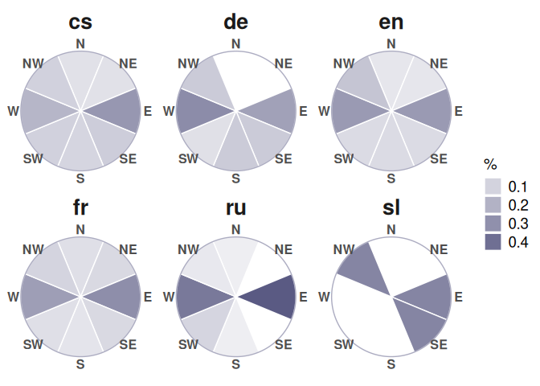
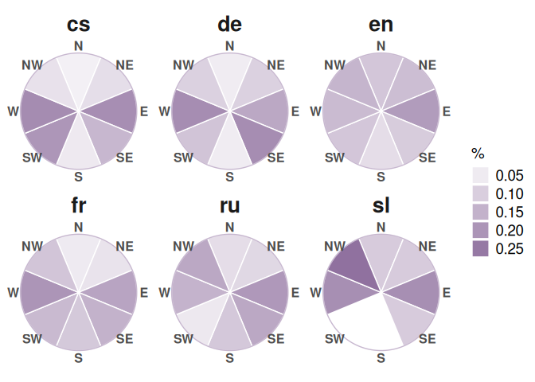

# 03_directions_modelling


## Directions modelling

The notebook adds compass-like categories as N, NE, E, etc. and create
viz to show the prevalent directions

``` r
library(tidyverse)
```

    ── Attaching core tidyverse packages ──────────────────────── tidyverse 2.0.0 ──
    ✔ dplyr     1.1.4     ✔ readr     2.1.6
    ✔ forcats   1.0.1     ✔ stringr   1.6.0
    ✔ ggplot2   4.0.1     ✔ tibble    3.3.1
    ✔ lubridate 1.9.4     ✔ tidyr     1.3.2
    ✔ purrr     1.2.1     
    ── Conflicts ────────────────────────────────────────── tidyverse_conflicts() ──
    ✖ dplyr::filter() masks stats::filter()
    ✖ dplyr::lag()    masks stats::lag()
    ℹ Use the conflicted package (<http://conflicted.r-lib.org/>) to force all conflicts to become errors

``` r
library(geosphere) # for Haversine dist calculation

library(cowplot)
```


    Attaching package: 'cowplot'

    The following object is masked from 'package:lubridate':

        stamp

``` r
library(MetBrewer)
theme_set(theme_minimal())
```

    Rows: 1,061
    Columns: 20
    $ lang           <chr> "cs", "cs", "cs", "cs", "cs", "cs", "cs", "cs", "cs", "…
    $ doc_key        <chr> "0001_0001-0001-0000-0008-0000", "0036_0001-0000-0000-0…
    $ from_id        <chr> "Q1497", "Q37200", "Q1410", "Q155975", "Q155975", "Q545…
    $ to_id          <chr> "Q668", "Q584", "Q545", "Q1887287", "Q1085", "Q13924", …
    $ text           <chr> "od břehů širých otce Missisipi až k Indu", "od Pyramid…
    $ author_name    <chr> "Albert, Eduard", "Breska, Alfons", "Breska, Alfons", "…
    $ year_birth     <int> 1841, 1873, 1873, 1857, 1857, 1836, 1836, 1836, 1836, 1…
    $ year_death     <int> 1900, 1946, 1946, 1890, 1890, 1905, 1905, 1905, 1905, 1…
    $ from_placename <chr> "Mississippi River", "Great Pyramid of Giza", "Gibralta…
    $ from_latitude  <dbl> 29.15360, 29.97915, 36.14000, 49.94844, 49.94844, 58.00…
    $ from_longitude <dbl> -89.250800, 31.134220, -5.350000, 15.268226, 15.268226,…
    $ from_type      <chr> "river", "default", "region", "city", "city", "sea", "m…
    $ from_type_d    <chr> "river", "default", "land", "city", "city", "sea", "mou…
    $ to_placename   <chr> "India", "Rhine", "Baltic Sea", "Malešov", "Prague", "A…
    $ to_latitude    <dbl> 22.80000, 47.66620, 58.00000, 49.91107, 50.08750, 42.77…
    $ to_longitude   <dbl> 83.000000, 9.178600, 20.000000, 15.224397, 14.421389, 1…
    $ to_type        <chr> "country", "river", "sea", "city", "city", "sea", "moun…
    $ to_type_d      <chr> "country", "river", "sea", "city", "city", "sea", "moun…
    $ text_long      <chr> " plemene lidského jsem poznal , pletě# všech pásem : n…
    $ id_short       <chr> "cs-9", "cs-1412", "cs-1412", "cs-2509", "cs-2509", "cs…

# Angle calculation

The idea is to calculate the angle between the clock handle to 12
o’clock (north) and the from-to vector. The default calculation start
counting angle from the x-axis (east) & counter-clockwise. So there are
some additional steps to calculate this as if we had a clock, that
NORTH=0°

Calculate angles

``` r
formulas_d <- formulas_d %>% 
  mutate(angle_east_deg = atan2(y2_0, x2_0) * 180 / pi,
         angle_north_deg = (90 - angle_east_deg + 360) %% 360) 
```

## Compass labels

Use `case_when`\`for separate into N, NE, E, SE, S, SW, W, NW groups, 45
degrees each.

``` r
formulas_d <- formulas_d %>% 
  mutate(
    compass = case_when(
      angle_north_deg < 22.5 | angle_north_deg >= 337.5 ~ "N",
      angle_north_deg < 67.5  ~ "NE",
      angle_north_deg < 112.5 ~ "E",
      angle_north_deg < 157.5 ~ "SE",
      angle_north_deg < 202.5 ~ "S",
      angle_north_deg < 247.5 ~ "SW",
      angle_north_deg < 292.5 ~ "W",
      TRUE                    ~ "NW"
    )
  )
```

### compass viz

Transformation of directions to compass view

``` r
dist_mean <- formulas_d %>% 
  group_by(lang) %>% 
  summarise(dist_mean = mean(dist_haversine),
            .groups = "drop")

totals <- formulas_d %>% 
  left_join(dist_mean, by = "lang") %>% 
  mutate(dist_longer_mean = ifelse(dist_haversine > dist_mean, "long", "short")) %>% 
  count(lang, dist_longer_mean) %>% 
  mutate(lang_d = paste0(lang, "_", dist_longer_mean)) %>% 
  rename(total_f = n)

# totals

x <- formulas_d %>% 
  left_join(dist_mean, by = "lang") %>% 
  mutate(dist_longer_mean = ifelse(dist_haversine > dist_mean, "long", "short")) %>% 
  mutate(lang_d = paste0(lang, "_", dist_longer_mean)) %>% 
  group_by(lang_d) %>% 
  count(compass) %>% 
  left_join(totals, by = "lang_d") %>% 
  mutate(perc = (n / total_f)) %>% 
  ungroup() %>% 
  mutate(value = 1)  
  
x %>% head()
```

    # A tibble: 6 × 8
      lang_d  compass     n lang  dist_longer_mean total_f   perc value
      <chr>   <fct>   <int> <chr> <chr>              <int>  <dbl> <dbl>
    1 cs_long N           5 cs    long                  86 0.0581     1
    2 cs_long NE          5 cs    long                  86 0.0581     1
    3 cs_long E          24 cs    long                  86 0.279      1
    4 cs_long SE         10 cs    long                  86 0.116      1
    5 cs_long S           8 cs    long                  86 0.0930     1
    6 cs_long SW          9 cs    long                  86 0.105      1

# Fig. 3b

Long distances compasses

``` r
long_dist_pizza <- x %>% 
  filter(dist_longer_mean == "long") %>% 
  ggplot(aes(x = compass, y = value)) + 
    geom_col(width = 1,
           position = "fill", colour = "white",
           fill = met.brewer("Cassatt1")[8],
           aes(alpha = perc)) + 
    facet_wrap(~lang) + 
    labs(alpha = "%") + 
    geom_hline(yintercept = 1.0, colour = met.brewer("Cassatt1")[8], alpha = 0.5) + 
    theme(
      panel.grid = element_blank(),
      axis.title = element_blank(),
      axis.text.y = element_blank(),
      strip.text = element_text(face = "bold", size = 20),
      #legend.position = "bottom",
      legend.text = element_text(size = 14),
      legend.title = element_text(size = 14),
      axis.text.x = element_text(face = "bold", size = 12)
      ) + 
    coord_polar(start = -pi/8) 

long_dist_pizza
```



# Fig. 4b

Short distances


