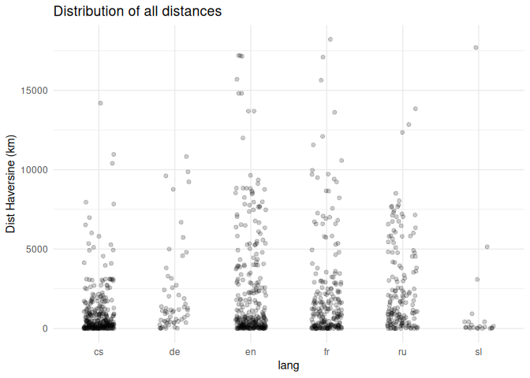
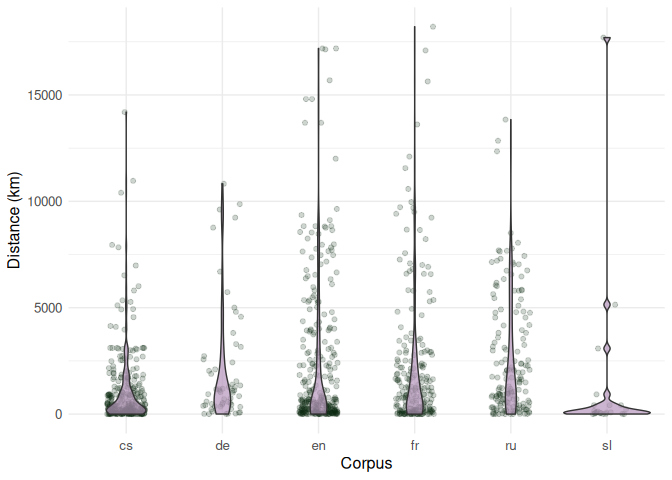
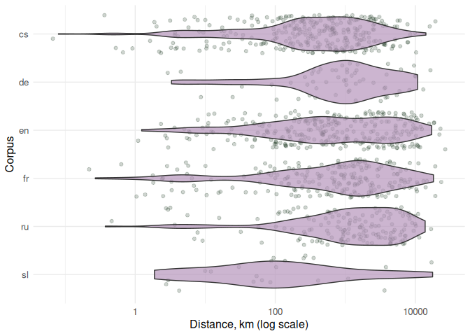

# 01 distances exploration


# Exploring the from_to formulas

This notebook provides a basic descriptive analysis of distances in the
dataset. It is structured as follows:

-   Most frequent locations: Compares the most frequent locations in the
    PoeTree corpora overall (all found locations) with those appearing
    from_to formulas;

-   Distances: Computes Haversine distances for the formulas and
    analyses their distribution;

-   Location Types: Assigns types of locations (natural / political,
    etc.) and examines how these types appear in formulas across
    different corpora and distance types;

-   Place Frequency: Identifies the locations that most frequently occur
    in the formulas.

``` r
library(tidyverse)

# maps pckg
library(sf)
library(ggspatial)
library(rnaturalearth)
library(rnaturalearthdata)

library(ggrepel)
library(MetBrewer)
library(cowplot)
library(kableExtra)
theme_set(theme_minimal())

library(geosphere) # distHavestine()
```

Read data as a table (flatted, merged, and manually cleaned json outputs
from PoeTree API)

``` r
formulas <- read.csv("../data/formulas_table.csv")
glimpse(formulas)
```

    Rows: 1,061
    Columns: 20
    $ lang           <chr> "cs", "cs", "cs", "cs", "cs", "cs", "cs", "cs", "cs", "…
    $ doc_key        <chr> "0001_0001-0001-0000-0008-0000", "0036_0001-0000-0000-0…
    $ from_id        <chr> "Q1497", "Q37200", "Q1410", "Q155975", "Q155975", "Q545…
    $ to_id          <chr> "Q668", "Q584", "Q545", "Q1887287", "Q1085", "Q13924", …
    $ text           <chr> "od břehů širých otce Missisipi až k Indu", "od Pyramid…
    $ author_name    <chr> "Albert, Eduard", "Breska, Alfons", "Breska, Alfons", "…
    $ year_birth     <int> 1841, 1873, 1873, 1857, 1857, 1836, 1836, 1836, 1836, 1…
    $ year_death     <int> 1900, 1946, 1946, 1890, 1890, 1905, 1905, 1905, 1905, 1…
    $ from_placename <chr> "Mississippi River", "Great Pyramid of Giza", "Gibralta…
    $ from_latitude  <dbl> 29.15360, 29.97915, 36.14000, 49.94844, 49.94844, 58.00…
    $ from_longitude <dbl> -89.250800, 31.134220, -5.350000, 15.268226, 15.268226,…
    $ from_type      <chr> "river", "default", "region", "city", "city", "sea", "m…
    $ from_type_d    <chr> "river", "default", "land", "city", "city", "sea", "mou…
    $ to_placename   <chr> "India", "Rhine", "Baltic Sea", "Malešov", "Prague", "A…
    $ to_latitude    <dbl> 22.80000, 47.66620, 58.00000, 49.91107, 50.08750, 42.77…
    $ to_longitude   <dbl> 83.000000, 9.178600, 20.000000, 15.224397, 14.421389, 1…
    $ to_type        <chr> "country", "river", "sea", "city", "city", "sea", "moun…
    $ to_type_d      <chr> "country", "river", "sea", "city", "city", "sea", "moun…
    $ text_long      <chr> " plemene lidského jsem poznal , pletě# všech pásem : n…
    $ id_short       <chr> "cs-9", "cs-1412", "cs-1412", "cs-2509", "cs-2509", "cs…

N formulas per language

      lang   n
    1   cs 308
    2   en 294
    3   fr 217
    4   ru 162
    5   de  58
    6   sl  22

## Most freq loc vs from_to loc

Examine if most most freq locations also appear in from_to formula;
calculate kendall rank correlation between the most frequent locations
in corpus overall and in formulas

    # A tibble: 119 × 8
       id         qid     lang  label   rank_ft rank_total from_to_count total_count
       <chr>      <chr>   <chr> <chr>     <int>      <int>         <int>       <int>
     1 cs_Q157290 Q157290 cs    Bohemi…       1         14            47         300
     2 cs_Q1085   Q1085   cs    Prague        2          1            25        2698
     3 cs_Q194263 Q194263 cs    Tatra …       3         12            20         341
     4 cs_Q1653   Q1653   cs    Danube        4         11            17         369
     5 cs_Q13924  Q13924  cs    Adriat…       5        107            14          37
     6 cs_Q43266  Q43266  cs    Moravia       6         10            14         436
     7 cs_Q214644 Q214644 cs    Giant …       7         42            13         119
     8 cs_Q545    Q545    cs    Baltic…       8         62            12          74
     9 cs_Q131574 Q131574 cs    Vltava        9          6            10         588
    10 cs_Q220    Q220    cs    Rome         10          3             9        1366
    # ℹ 109 more rows

    # A tibble: 6 × 2
      lang  kendall_cor
      <chr>       <dbl>
    1 cs          0.179
    2 de          0.439
    3 en          0.158
    4 fr          0.242
    5 ru          0.432
    6 sl          0.211

    [1] 0.2766082

# Distances

Haversine (bird/plane flight) distance between the from-\>to
coordinates, the distance is in km.

### calculation

``` r
# calculate haversine distances between from_to points in current table

formulas_d <- formulas %>% 
  rowwise() %>% 
  mutate(dist_haversine = distHaversine(
    c(from_longitude, from_latitude),
    c(to_longitude, to_latitude)) 
      / 1000) %>% 
  ungroup() %>% 
  # make numbers human-readable
  mutate(dist_haversine = round(dist_haversine, digits = 3)) 

head(formulas_d %>% select(lang, text, from_placename, to_placename, dist_haversine))
```

    # A tibble: 6 × 5
      lang  text                          from_placename to_placename dist_haversine
      <chr> <chr>                         <chr>          <chr>                 <dbl>
    1 cs    od břehů širých otce Missisi… Mississippi R… India              14195.  
    2 cs    od Pyramid k Rýnu , od Gibra… Great Pyramid… Rhine               2720.  
    3 cs    od Gibraltaru k bouřným vlná… Gibraltar      Baltic Sea          3063.  
    4 cs    od Hor Kuten k Malešovu       Kutná Hora     Malešov                5.21
    5 cs    Od Hor Kuten veden k Praze    Kutná Hora     Prague                62.5 
    6 cs    od Baltu až k Adrii           Baltic Sea     Adriatic Sea        1725.  

## Fig 1: Example

Four-parts figure showing how we go from a map to compass

``` r
exmpl <- formulas_d %>% 
   filter(str_detect(to_placename, "Rome")) %>% 
   filter(str_detect(author_name, "Whittier")) # specific line in eng

# exmpl <- formulas_d %>% 
#   filter(str_detect(from_placename, "Rhine") & str_detect(to_placename, "Danube"))

# exmpl
exmpl$text
```

    [1] "From Malta 's temples to the gates of Rome"

``` r
exmpl$dist_haversine
```

    [1] 691.395

``` r
exmpl %>% select(from_placename, from_longitude, from_latitude, 
                 to_placename, to_longitude, to_latitude)
```

    # A tibble: 1 × 6
      from_placename from_longitude from_latitude to_placename to_longitude
      <chr>                   <dbl>         <dbl> <chr>               <dbl>
    1 Malta                    14.5          35.9 Rome                 12.5
    # ℹ 1 more variable: to_latitude <dbl>

``` r
exmpl %>% 
  mutate(x1_0 = 0.0,
         y1_0 = 0.0,
         
         x2_0 = to_longitude - from_longitude,
         y2_0 = to_latitude - from_latitude) %>% 
  select(from_placename, from_longitude, from_latitude, 
                 to_placename, to_longitude, to_latitude,
         x1_0, y1_0, x2_0, y2_0)
```

    # A tibble: 1 × 10
      from_placename from_longitude from_latitude to_placename to_longitude
      <chr>                   <dbl>         <dbl> <chr>               <dbl>
    1 Malta                    14.5          35.9 Rome                 12.5
    # ℹ 5 more variables: to_latitude <dbl>, x1_0 <dbl>, y1_0 <dbl>, x2_0 <dbl>,
    #   y2_0 <dbl>

Basic map 1

Map 2: no background line plot

Map 3: transposed

Map 4: Clock plot:

``` r
plot_grid(map_1, map_2, map_3, map_4,
          nrow = 1,
          labels = c("1", "2", "3", "4"), label_size = 36)
```

## Dist distribution

Poet’s mind is often flying not that far away?



Most of the distances are actually very small; but for some traditions
there are quite a portion of longer ones.

## Fig 2: dist distribution





### dist summary stats

Calculate mean & median dist for each corpus + 3rd quantile

    # A tibble: 6 × 4
      lang  dist_mean dist_median third_quant
      <chr>     <dbl>       <dbl>       <dbl>
    1 cs        1054.       436.        1217.
    2 de        2143.      1100.        2538.
    3 en        2335.       648.        3150.
    4 fr        2213.       974.        2516.
    5 ru        2551.      1478.        4112.
    6 sl        1321.        90.9        418.

Attach means & medians and add grouping lables: if grouped to short/long
based on the means in each language, proportion of short/long is almost
the same, about 30/70

    # A tibble: 12 × 5
       lang  dist_long     n n_total  perc
       <chr> <chr>     <int>   <int> <dbl>
     1 cs    long         86     308  27.9
     2 cs    short       222     308  72.1
     3 de    long         16      58  27.6
     4 de    short        42      58  72.4
     5 en    long         92     294  31.3
     6 en    short       202     294  68.7
     7 fr    long         62     217  28.6
     8 fr    short       155     217  71.4
     9 ru    long         54     162  33.3
    10 ru    short       108     162  66.7
    11 sl    long          3      22  13.6
    12 sl    short        19      22  86.4

% longer than 1000 km

    # A tibble: 12 × 5
       lang  dist_long     n n_total  perc
       <chr> <chr>     <int>   <int> <dbl>
     1 cs    long        113     308  36.7
     2 cs    short       195     308  63.3
     3 de    long         34      58  58.6
     4 de    short        24      58  41.4
     5 en    long        130     294  44.2
     6 en    short       164     294  55.8
     7 fr    long        120     217  55.3
     8 fr    short        97     217  44.7
     9 ru    long        106     162  65.4
    10 ru    short        56     162  34.6
    11 sl    long          4      22  18.2
    12 sl    short        18      22  81.8

The longest distances examples:

    # A tibble: 10 × 7
       lang  text       from_type to_type from_placename to_placename dist_haversine
       <chr> <chr>      <chr>     <chr>   <chr>          <chr>                 <dbl>
     1 fr    De les An… mountain  mounta… Andes          Tibet                18210.
     2 sl    iz Launce… city      city    Launceston     St Helens            17697.
     3 en    From Chin… country   country China          Peru                 17186.
     4 en    from Chin… country   country China          Peru                 17186.
     5 en    From the … default   region  Antarctica     Alaska               17143.
     6 fr    De la Chi… country   country People's Repu… Peru                 17093.
     7 en    From Hoba… city      city    Hobart         Hammerfest           15690.
     8 fr    De Behrin… strait (… strait… Bering Strait  Strait of M…         15635.
     9 en    From the … region    region  Tierra del Fu… Alaska               14809.
    10 en    from the … region    region  Tierra del Fu… Alaska               14809.

# Types

How distances are related to the types of locations in from-to formula?

### Overview

Total

    # A tibble: 20 × 2
       type_pair                   n
       <chr>                   <int>
     1 city --> city             227
     2 river --> river           116
     3 mountain --> mountain      62
     4 country --> country        35
     5 region --> city            30
     6 river --> city             28
     7 region --> region          26
     8 village --> city           26
     9 city --> country           24
    10 city part --> city part    22
    11 city --> river             18
    12 ancient city --> city      17
    13 city --> village           17
    14 city --> region            16
    15 city part --> city         14
    16 region --> mountain        13
    17 region --> river           13
    18 village --> village        13
    19 country --> city           11
    20 region --> country         11

Create larger groups

``` r
unique(c(formulas_d$from_type, formulas_d$to_type))
```

     [1] "river"          "default"        "region"         "city"          
     [5] "sea"            "mountain"       "country"        "bay"           
     [9] "castle/fort"    "ancient city"   "village"        "city part"     
    [13] "lake"           "island"         "ancient region" "continent"     
    [17] "volcano"        "cape"           "palace"         "strait (water)"
    [21] "ancient site"   "hill"          

``` r
types_groups <- tibble(type_original = unique(c(formulas_d$from_type, formulas_d$to_type)),
       type_grouped = c("water", "other", "land", 
                        "city", "water", "mountain", 
                        "country", "water", "settlement", 
                        "city", "settlement", "city", 
                        "water", "land", "land", 
                        "land", "mountain", "water", 
                        "settlement", "water", "mountain", 
                        "settlement"), 
       type_major = c("natural", "natural", "natural", 
                      "political", "natural", "natural", 
                      "political", "natural", "political", 
                      "political", "political", "political", 
                      "natural", "natural", "political", 
                      "natural", "natural", "natural", 
                      "political", "natural", "natural", 
                      "political"))

# attach to the main table for from- and to-locs
formulas_d <- formulas_d %>% 
  left_join(types_groups %>% 
              rename(
                from_type = type_original,
                from_type_group = type_grouped,
                from_type_major = type_major),
            by = "from_type") %>% 
  left_join(types_groups %>% 
              rename(
                to_type = type_original,
                to_type_group = type_grouped,
                to_type_major = type_major),
            by = "to_type") 
```

    # A tibble: 7 × 2
      from_type_group     n
      <chr>           <int>
    1 city              425
    2 country            75
    3 land              136
    4 mountain          107
    5 other              25
    6 settlement         66
    7 water             227

    # A tibble: 7 × 2
      to_type_group     n
      <chr>         <int>
    1 city            454
    2 country          95
    3 land            124
    4 mountain        110
    5 other             9
    6 settlement       49
    7 water           220

    # A tibble: 2 × 2
      from_type_major     n
      <chr>           <int>
    1 natural           493
    2 political         568

    # A tibble: 2 × 2
      to_type_major     n
      <chr>         <int>
    1 natural         458
    2 political       603

``` r
types_groups
```

    # A tibble: 22 × 3
       type_original type_grouped type_major
       <chr>         <chr>        <chr>     
     1 river         water        natural   
     2 default       other        natural   
     3 region        land         natural   
     4 city          city         political 
     5 sea           water        natural   
     6 mountain      mountain     natural   
     7 country       country      political 
     8 bay           water        natural   
     9 castle/fort   settlement   political 
    10 ancient city  city         political 
    # ℹ 12 more rows

Count 22 classes

    # A tibble: 22 × 2
       to_type          n
       <chr>        <int>
     1 city           733
     2 river          358
     3 mountain       208
     4 region         197
     5 country        170
     6 village         93
     7 city part       87
     8 ancient city    59
     9 sea             48
    10 island          40
    # ℹ 12 more rows

    # A tibble: 12 × 4
       lang_type    type_total n_total type_perc
       <chr>             <int>   <dbl>     <dbl>
     1 cs_natural          340     616      55.2
     2 cs_political        276     616      44.8
     3 de_natural           47     116      40.5
     4 de_political         69     116      59.5
     5 en_natural          236     588      40.1
     6 en_political        352     588      59.9
     7 fr_natural          159     434      36.6
     8 fr_political        275     434      63.4
     9 ru_natural          154     324      47.5
    10 ru_political        170     324      52.5
    11 sl_natural           15      44      34.1
    12 sl_political         29      44      65.9

6 classes distribution

    # A tibble: 38 × 4
       lang_type     type_total n_total type_perc
       <chr>              <int>   <dbl>     <dbl>
     1 cs_city              199     616      32.3
     2 cs_country            43     616       7  
     3 cs_land               67     616      10.9
     4 cs_mountain          139     616      22.6
     5 cs_other               9     616       1.5
     6 cs_settlement         32     616       5.2
     7 cs_water             127     616      20.6
     8 de_city               53     116      45.7
     9 de_country             8     116       6.9
    10 de_land                9     116       7.8
    # ℹ 28 more rows

### long / short

#### dist ranks

The most frequent types of connection for short and long distances
(based on the mean); numbers are ranks

    # A tibble: 20 × 3
       type_pair                     short  long
       <chr>                         <int> <int>
     1 city --> city                     1     2
     2 river --> river                   2     1
     3 mountain --> mountain             3     5
     4 village --> city                  4    83
     5 city part --> city part           5    NA
     6 river --> city                    6    10
     7 region --> city                   7     6
     8 region --> region                 8     7
     9 city --> village                  9    49
    10 city --> region                  10    22
    11 city --> river                   11    13
    12 village --> village              12    NA
    13 city part --> city               13    30
    14 country --> country              14     3
    15 region --> mountain              15    39
    16 ancient city --> city            16     8
    17 mountain --> river               17    NA
    18 region --> river                 18    14
    19 ancient city --> ancient city    19    NA
    20 city --> city part               20    27

    # A tibble: 20 × 3
       type_pair             short  long
       <chr>                 <int> <int>
     1 river --> river           2     1
     2 city --> city             1     2
     3 country --> country      14     3
     4 city --> country         28     4
     5 mountain --> mountain     3     5
     6 region --> city           7     6
     7 region --> region         8     7
     8 ancient city --> city    16     8
     9 country --> region       39     9
    10 river --> city            6    10
    11 sea --> region           NA    11
    12 sea --> sea              62    12
    13 city --> river           11    13
    14 region --> river         18    14
    15 country --> city         22    15
    16 country --> island       88    16
    17 island --> city          33    17
    18 region --> country       23    18
    19 river --> country       107    19
    20 river --> region         26    20

Village –\> village distances

    # A tibble: 10 × 5
       lang  dist_haversine text                         from_placename to_placename
       <chr>          <dbl> <chr>                        <chr>          <chr>       
     1 en            252.   From Xivray to Cantigny      Xivray-et-Mar… Cantigny    
     2 en             84.9  from haunted Glamis To haun… Glamis         Woodhouselee
     3 en             54.3  From Partney down to Stow    Partney        Stow        
     4 cs             49.3  od Herálce do Pikárce        Herálec        Pikárec     
     5 cs             14.8  Od Vinićů přes Bělopavliće … Vinići         Spuž        
     6 cs             12.8  ze Sychrova a dále k Jivině  Sychrov        Jivina      
     7 en              9.04 From the Milton Woods to Do… Milton Abbas   Plush       
     8 en              8.39 From Haslingfield to Mading… Haslingfield   Madingley   
     9 en              5.67 From Amberley to Storrington Amberley       Storrington 
    10 en              5.67 From Storrington to Amberley Storrington    Amberley    

    [1] 9.043

### median and mean distances by top-5 patterns

    # A tibble: 7 × 2
      type_pair                   n
      <chr>                   <int>
    1 city --> city             187
    2 river --> river            74
    3 mountain --> mountain      49
    4 village --> city           25
    5 city part --> city part    22
    6 river --> city             22
    7 region --> city            19

    # A tibble: 7 × 3
      type_pair               mean_dist med_dist
      <chr>                       <dbl>    <dbl>
    1 city --> city              406.     216.  
    2 city part --> city part      6.70     3.97
    3 mountain --> mountain      437.     255.  
    4 region --> city            498.     196.  
    5 river --> city             395.     236.  
    6 river --> river            905.     766.  
    7 village --> city           184.     103.  

    # A tibble: 7 × 2
      type_pair                 n
      <chr>                 <int>
    1 river --> river          42
    2 city --> city            40
    3 country --> country      23
    4 city --> country         19
    5 mountain --> mountain    13
    6 region --> city          11
    7 region --> region         9

    # A tibble: 7 × 3
      type_pair             mean_dist med_dist
      <chr>                     <dbl>    <dbl>
    1 city --> city             6015.    5822.
    2 city --> country          6793.    7696.
    3 country --> country       7551.    6488.
    4 mountain --> mountain     5407.    3109.
    5 region --> city           4794.    3249.
    6 region --> region         6433.    4012.
    7 river --> river           4159.    3490.

#### by language

<table>
<colgroup>
<col style="width: 1%" />
<col style="width: 98%" />
</colgroup>
<thead>
<tr>
<th style="text-align: left;">lang</th>
<th style="text-align: left;">top_list</th>
</tr>
</thead>
<tbody>
<tr>
<td style="text-align: left;">cs</td>
<td style="text-align: left;">city –&gt; city (49) <br> mountain –&gt;
mountain (48) <br> river –&gt; river (28) <br> region –&gt; city (11)
<br> country –&gt; country (8) <br> region –&gt; mountain (8) <br> city
–&gt; river (7) <br> city –&gt; village (7) <br> river –&gt; city (6)
<br> sea –&gt; sea (6)</td>
</tr>
<tr>
<td style="text-align: left;">de</td>
<td style="text-align: left;">city –&gt; city (16) <br> river –&gt;
river (10) <br> village –&gt; city (4) <br> city –&gt; region (2) <br>
country –&gt; country (2)</td>
</tr>
<tr>
<td style="text-align: left;">en</td>
<td style="text-align: left;">city –&gt; city (57) <br> river –&gt;
river (24) <br> country –&gt; country (19) <br> region –&gt; region (15)
<br> city –&gt; country (10) <br> region –&gt; city (10) <br> village
–&gt; village (9) <br> city –&gt; village (7) <br> river –&gt; city (7)
<br> city –&gt; river (6) <br> city part –&gt; city part (6) <br>
village –&gt; city (6)</td>
</tr>
<tr>
<td style="text-align: left;">fr</td>
<td style="text-align: left;">city –&gt; city (59) <br> river –&gt;
river (30) <br> village –&gt; city (10) <br> ancient city –&gt; city (9)
<br> city part –&gt; city part (6) <br> region –&gt; city (6) <br>
region –&gt; region (6) <br> ancient city –&gt; ancient city (5) <br>
river –&gt; city (5) <br> city –&gt; city part (4) <br> city –&gt;
country (4) <br> island –&gt; city (4) <br> mountain –&gt; mountain
(4)</td>
</tr>
<tr>
<td style="text-align: left;">ru</td>
<td style="text-align: left;">city –&gt; city (39) <br> river –&gt;
river (21) <br> river –&gt; city (10) <br> city part –&gt; city part (6)
<br> mountain –&gt; mountain (6) <br> city –&gt; country (5) <br>
country –&gt; country (5) <br> region –&gt; river (4) <br> ancient city
–&gt; city (3) <br> city –&gt; region (3) <br> city –&gt; river (3) <br>
city part –&gt; city (3) <br> country –&gt; region (3) <br> region –&gt;
city (3) <br> region –&gt; region (3) <br> river –&gt; region (3) <br>
sea –&gt; region (3)</td>
</tr>
<tr>
<td style="text-align: left;">sl</td>
<td style="text-align: left;">city –&gt; city (7) <br> river –&gt; river
(3) <br> city part –&gt; city (2)</td>
</tr>
</tbody>
</table>

#### longer vs shorter distances

    # A tibble: 57 × 4
       lang  dist_type type_pair                 n
       <chr> <chr>     <chr>                 <int>
     1 cs    long      river --> river          14
     2 cs    long      mountain --> mountain     9
     3 cs    long      sea --> sea               6
     4 cs    long      country --> country       4
     5 cs    long      river --> sea             4
     6 cs    short     city --> city            46
     7 cs    short     mountain --> mountain    39
     8 cs    short     river --> river          14
     9 cs    short     region --> city           9
    10 cs    short     city --> village          7
    # ℹ 47 more rows

### city parts

    # A tibble: 36 × 3
       lang  from_placename     n
       <chr> <chr>          <int>
     1 cs    Žižkov             3
     2 fr    Montmartre         3
     3 ru    Moscow Kremlin     3
     4 cs    Frýdek             2
     5 cs    Hradčany           2
     6 cs    Můstek             2
     7 fr    Suburra            2
     8 cs    Gradec             1
     9 cs    Jinonice           1
    10 cs    Kaňk               1
    # ℹ 26 more rows

    # A tibble: 31 × 3
       lang  to_placename             n
       <chr> <chr>                <int>
     1 en    Rotherhithe              3
     2 fr    Capitoline Hill          3
     3 cs    Powder Tower             2
     4 fr    Champ de Mars            2
     5 fr    La Madeleine             2
     6 fr    Moscow Kremlin           2
     7 fr    Quartier de Bercy        2
     8 ru    Zemlyanoy Val Street     2
     9 cs    Horská brána             1
    10 cs    Karlín                   1
    # ℹ 21 more rows

    # A tibble: 63 × 3
       lang  placename        n
       <chr> <chr>        <int>
     1 cs    Žižkov           3
     2 cs    Frýdek           2
     3 cs    Hradčany         2
     4 cs    Můstek           2
     5 cs    Powder Tower     2
     6 cs    Gradec           1
     7 cs    Horská brána     1
     8 cs    Jinonice         1
     9 cs    Karlín           1
    10 cs    Kaňk             1
    # ℹ 53 more rows

    # A tibble: 22 × 4
       lang  text                                        from_placename to_placename
       <chr> <chr>                                       <chr>          <chr>       
     1 cs    od Můstku až k Prašné bráně                 Můstek         Powder Tower
     2 cs    z Hradčan do Karlína                        Hradčany       Karlín      
     3 cs    od temene Kaňku k Horské bráně              Kaňk           Horská brána
     4 cs    od Můstku k Prašné bráně                    Můstek         Powder Tower
     5 en    From Charing Cross to Ludgate Hill          Charing Cross  Ludgate Hill
     6 en    from Limehouse to Blackwall                 Limehouse      Blackwall   
     7 en    from Woollahra to Balmain                   Woollahra      Balmain     
     8 en    From Camberwell to Aldgate                  Camberwell     Aldgate     
     9 en    From Knightsbridge , Pancras , Camden Town… St Pancras     Rotherhithe 
    10 en    From Knightsbridge , Pancras , Camden Town… Camden Town    Rotherhithe 
    # ℹ 12 more rows

    # A tibble: 3 × 25
      lang  doc_key from_id to_id   text           author_name year_birth year_death
      <chr> <chr>   <chr>   <chr>   <chr>          <chr>            <int>      <int>
    1 fr    ANG4    Q2634   Q133274 De Naples à l… ANGOT, Alb…       1865         NA
    2 fr    HUG39   Q133274 Q28471  De le Kremlin… HUGO, Vict…       1802       1885
    3 fr    HUG43   Q1741   Q133274 de les Pyrami… HUGO, Vict…       1802       1885
    # ℹ 17 more variables: from_placename <chr>, from_latitude <dbl>,
    #   from_longitude <dbl>, from_type <chr>, from_type_d <chr>,
    #   to_placename <chr>, to_latitude <dbl>, to_longitude <dbl>, to_type <chr>,
    #   to_type_d <chr>, text_long <chr>, id_short <chr>, dist_haversine <dbl>,
    #   from_type_group <chr>, from_type_major <chr>, to_type_group <chr>,
    #   to_type_major <chr>

# Places frequency

### from-to formulas

                              from_to_pair n
    1  Giant Mountains --> Bohemian Forest 9
    2  Bohemian Forest --> Tatra Mountains 8
    3          Baltic Sea --> Adriatic Sea 5
    4                   France --> England 4
    5                   Moravia --> Prague 4
    6                    Beersheba --> Dan 3
    7   Bohemian Forest --> Ural Mountains 3
    8                   Canada --> Georgia 3
    9                    Dan --> Beersheba 3
    10          Sněžka --> Bohemian Forest 3
    11 Tatra Mountains --> Bohemian Forest 3
    12  Ural Mountains --> Bohemian Forest 3
    13                   Africa --> Europe 2
    14                   Athens --> Delphi 2
    15                    Babylon --> Rome 2
    16         Balkans --> Bohemian Forest 2
    17              Baltic Sea --> Siberia 2
    18               Bethlehem --> Calvary 2
    19                   Bitola --> Danube 2
    20               Bordeaux --> Narbonne 2

By language (n \> 1)

<table>
<thead>
<tr>
<th style="text-align: left;">lang</th>
<th style="text-align: left;">from_to_pair</th>
<th style="text-align: right;">n</th>
</tr>
</thead>
<tbody>
<tr>
<td style="text-align: left;">cs</td>
<td style="text-align: left;">Giant Mountains –&gt; Bohemian Forest</td>
<td style="text-align: right;">9</td>
</tr>
<tr>
<td style="text-align: left;">cs</td>
<td style="text-align: left;">Bohemian Forest –&gt; Tatra Mountains</td>
<td style="text-align: right;">8</td>
</tr>
<tr>
<td style="text-align: left;">cs</td>
<td style="text-align: left;">Baltic Sea –&gt; Adriatic Sea</td>
<td style="text-align: right;">5</td>
</tr>
<tr>
<td style="text-align: left;">cs</td>
<td style="text-align: left;">Moravia –&gt; Prague</td>
<td style="text-align: right;">4</td>
</tr>
<tr>
<td style="text-align: left;">cs</td>
<td style="text-align: left;">Bohemian Forest –&gt; Ural Mountains</td>
<td style="text-align: right;">3</td>
</tr>
<tr>
<td style="text-align: left;">en</td>
<td style="text-align: left;">Beersheba –&gt; Dan</td>
<td style="text-align: right;">3</td>
</tr>
<tr>
<td style="text-align: left;">en</td>
<td style="text-align: left;">Canada –&gt; Georgia</td>
<td style="text-align: right;">3</td>
</tr>
<tr>
<td style="text-align: left;">en</td>
<td style="text-align: left;">France –&gt; England</td>
<td style="text-align: right;">3</td>
</tr>
<tr>
<td style="text-align: left;">en</td>
<td style="text-align: left;">Chile –&gt; Caribbean Sea</td>
<td style="text-align: right;">2</td>
</tr>
<tr>
<td style="text-align: left;">en</td>
<td style="text-align: left;">China –&gt; Peru</td>
<td style="text-align: right;">2</td>
</tr>
<tr>
<td style="text-align: left;">fr</td>
<td style="text-align: left;">Bordeaux –&gt; Narbonne</td>
<td style="text-align: right;">2</td>
</tr>
<tr>
<td style="text-align: left;">fr</td>
<td style="text-align: left;">Lake Geneva –&gt; Appenzell</td>
<td style="text-align: right;">2</td>
</tr>
<tr>
<td style="text-align: left;">fr</td>
<td style="text-align: left;">Louvre Palace –&gt; Champ de Mars</td>
<td style="text-align: right;">2</td>
</tr>
<tr>
<td style="text-align: left;">fr</td>
<td style="text-align: left;">Paris –&gt; Moscow</td>
<td style="text-align: right;">2</td>
</tr>
<tr>
<td style="text-align: left;">fr</td>
<td style="text-align: left;">Paris –&gt; Rome</td>
<td style="text-align: right;">2</td>
</tr>
<tr>
<td style="text-align: left;">ru</td>
<td style="text-align: left;">Baltic Sea –&gt; Siberia</td>
<td style="text-align: right;">2</td>
</tr>
<tr>
<td style="text-align: left;">ru</td>
<td style="text-align: left;">Khodynka –&gt; Tsushima</td>
<td style="text-align: right;">2</td>
</tr>
<tr>
<td style="text-align: left;">ru</td>
<td style="text-align: left;">Moscow –&gt; Beijing</td>
<td style="text-align: right;">2</td>
</tr>
<tr>
<td style="text-align: left;">ru</td>
<td style="text-align: left;">Mount Ararat –&gt; Carpathian
Mountains</td>
<td style="text-align: right;">2</td>
</tr>
<tr>
<td style="text-align: left;">sl</td>
<td style="text-align: left;">Drava –&gt; Soča</td>
<td style="text-align: right;">2</td>
</tr>
</tbody>
</table>

### most from / to places

Filter n \> 3 !

    # A tibble: 17 × 4
    # Groups:   lang [4]
       lang  from_placename  from_type        n
       <chr> <chr>           <chr>        <int>
     1 cs    Bohemian Forest mountain        18
     2 cs    Giant Mountains mountain        12
     3 cs    Prague          city            10
     4 cs    Moravia         region           9
     5 cs    Tatra Mountains mountain         8
     6 en    Maine           region           5
     7 en    China           country          4
     8 en    Ireland         island           4
     9 fr    Paris           city            12
    10 fr    Tagus River     river            8
    11 fr    Ganges          river            4
    12 fr    Memphis         ancient city     4
    13 ru    Baltic Sea      sea              6
    14 ru    Moscow          city             6
    15 ru    Neva            river            5
    16 ru    Nile            river            4
    17 ru    Volga           river            4

    # A tibble: 18 × 4
    # Groups:   lang [5]
       lang  to_placename     to_type      n
       <chr> <chr>            <chr>    <int>
     1 cs    Bohemian Forest  mountain    29
     2 cs    Prague           city        15
     3 cs    Tatra Mountains  mountain    12
     4 cs    Adriatic Sea     sea         10
     5 cs    Danube           river       10
     6 de    Rhine            river        4
     7 en    Maine            region       5
     8 en    Rhine            river        5
     9 en    Egypt            country      4
    10 en    England          country      4
    11 en    River Tyne       river        4
    12 en    Rome             city         4
    13 fr    Rome             city         6
    14 fr    Kythira          island       4
    15 fr    Paris            city         4
    16 ru    Neva             river        4
    17 ru    Saint Petersburg city         4
    18 ru    Western Bug      river        4

### most freq places in general

General frequencies (highly dependent on N formulas from a language)

            id       placename  n rank_freq
    1  Q157290 Bohemian Forest 47         1
    2     Q220            Rome 27         2
    3      Q90           Paris 27         3
    4    Q1085          Prague 26         4
    5    Q1653          Danube 24         5
    6     Q545      Baltic Sea 22         6
    7     Q584           Rhine 21         7
    8  Q194263 Tatra Mountains 20         8
    9     Q649          Moscow 16         9
    10  Q13924    Adriatic Sea 15        10
    11    Q626           Volga 15        11
    12  Q13712           Tiber 14        12
    13  Q43266         Moravia 14        13
    14 Q214644 Giant Mountains 13        14
    15   Q5089          Ganges 13        15
    16  Q14294     Tagus River 12        16
    17   Q1741          Vienna 12        17
    18   Q3392            Nile 12        18
    19    Q645            Neva 12        19
    20     Q79           Egypt 12        20

Locations mentioned in the most of corpora (either from or to)

    # A tibble: 24 × 5
       id     placename            type         n_corpora     n
       <chr>  <chr>                <chr>            <int> <int>
     1 Q1524  Athens               ancient city         5     7
     2 Q545   Baltic Sea           sea                  5    22
     3 Q85    Cairo                city                 5     9
     4 Q1288  Carpathian Mountains mountain             5     9
     5 Q1653  Danube               river                5    24
     6 Q34589 Euphrates            river                5     8
     7 Q5089  Ganges               river                5    13
     8 Q90    Paris                city                 5    27
     9 Q584   Rhine                river                5    21
    10 Q220   Rome                 city                 5    27
    # ℹ 14 more rows
